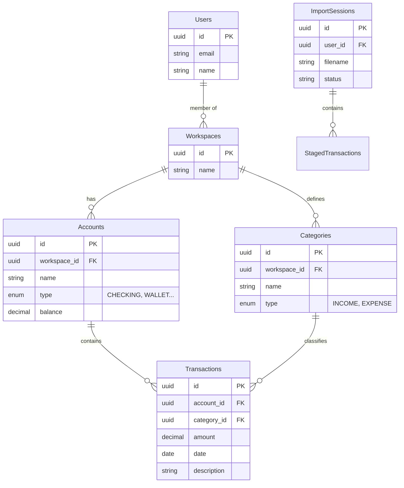

# Arquitetura de Banco de Dados

O FinTrack utiliza **PostgreSQL** como banco de dados relacional. O schema é normalizado e faz uso intensivo de chaves estrangeiras para garantir integridade referencial.

## Diagrama ER (Entidade-Relacionamento)

*Nota: O diagrama acima é uma simplificação das principais entidades. O schema real possui mais tabelas como `cards`, `tags`, `recurring_transactions`, etc.*

## Tabelas Principais

### Núcleo Financeiro
- **`accounts`**: Contas bancárias, carteiras.
- **`cards`**: Cartões de crédito (vinculados a uma conta para pagamento).
- **`incomes` / `expenses` / `transfers`**: Tabelas separadas para cada tipo de transação, permitindo campos específicos e melhor organização.

### Categorização
- **`categories`**: Categorias macro (ex: Alimentação).
- **`sub_categories`**: Refinamento (ex: Restaurante, Mercado).
- **`tags`**: Marcadores transversais (ex: #ferias, #reembolsavel).

### Importação e IA
- **`import_sessions`**: Representa um arquivo (CSV) sendo processado.
- **`staged_transactions`**: Transações temporárias aguardando aprovação.
- **`category_embeddings`**: Armazena vetores de texto para busca semântica e sugestões de categorização.

## Tipos Enum

O banco utiliza tipos ENUM do Postgres para garantir integridade de domínios fixos:
- `transaction_status`: VALIDATING, PAID, PENDING, IGNORE.
- `account_type`: CHECKING, SAVINGS, INVESTMENT, etc.
