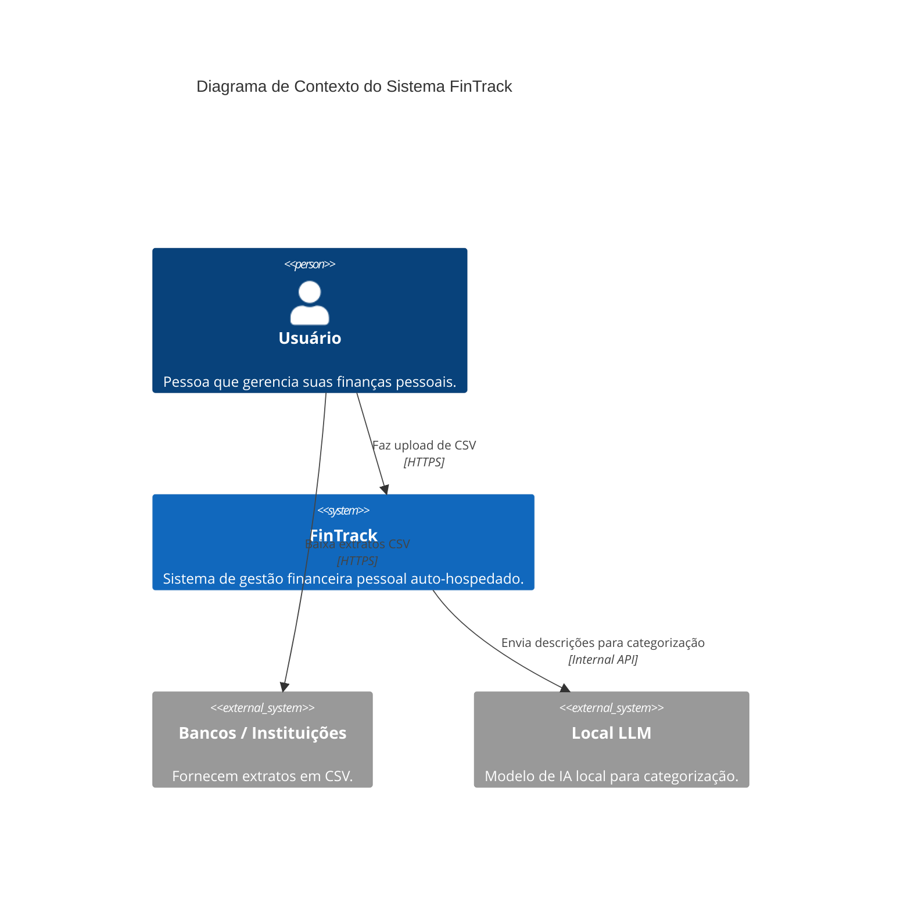
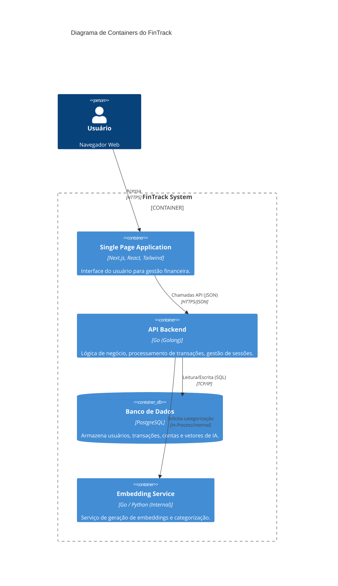

# Visão Geral da Arquitetura

O FinTrack adota uma arquitetura moderna, modular e orientada a serviços (mesmo que implantada como monolito modular), focada em manutenibilidade e escalabilidade.

## Diagrama C4 (Contexto)

## Diagrama de Containers

## Componentes Chave

### 1. Frontend (SPA)
Construído com **Next.js**, oferece uma experiência reativa e rápida. Utiliza **Shadcn UI** para componentes visuais consistentes e **Axios** para comunicação com a API. O estado da aplicação é gerenciado localmente e via hooks.

### 2. Backend (API)
Desenvolvido em **Go**, seguindo os princípios de **Clean Architecture**.
- **Camadas**:
    - `Handler/Controller`: Recebe requisições HTTP.
    - `UseCase`: Contém a lógica de negócio pura.
    - `Repository`: Abstrai o acesso a dados.
    - `Entity`: Define os objetos de domínio.

### 3. Banco de Dados
**PostgreSQL** é utilizado como fonte de verdade. Ele armazena não apenas dados relacionais (contas, transações), mas também **vetores (embeddings)** para o sistema de recomendação de categorias (via extensão `pgvector` ou simulação de vetores em tabelas convencionais, conforme schema).

### 4. Serviço de IA
Um componente focado em receber textos de transações (ex: "COMPRA STARBUCKS SAO PAULO") e retornar sugestões de categorias normalizadas (ex: "Alimentação > Café"). Ele utiliza embeddings para encontrar similaridades com transações passadas.
