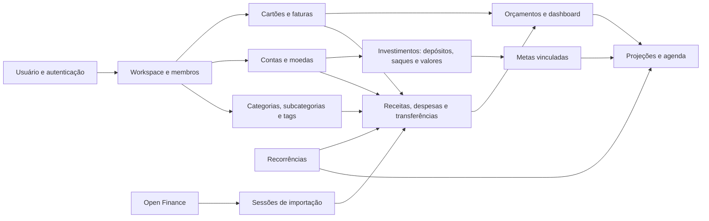

# Mapa de domínio e efeitos

O diagrama mostra dependências de informação, não promete que toda seta cria lançamentos automaticamente. Por exemplo, vincular um investimento a uma meta altera a leitura do progresso da meta, mas não cria um depósito financeiro; comparar oportunidades gera uma simulação, sem gravar investimento. A importação só altera o livro de lançamentos quando a sessão é confirmada. Uma agenda pode conter projeções ainda não pagas.

## Caminho de uma operação

1. A página em `frontend/src/app/(fintrack)` usa hooks em `frontend/src/hooks` ou serviços em `frontend/src/services`; chamadas HTTP passam pela instância `frontend/src/lib/api.ts`, que transporta cookie, CSRF e workspace. `frontend/src/lib/api-retry.ts` fixa o workspace por requisição e só tenta de novo automaticamente métodos seguros ou escritas com chave de idempotência.
2. `backend/internal/controller/http/v1/router.go` compõe rate limit, autenticação, CSRF, MFA, autorização de workspace e handlers. Rotas de perfil/workspace não usam todas o mesmo middleware de workspace; o [guia de acesso](./access-categories-tools.md) distingue os casos.
3. O handler valida a entrada e chama um caso de uso em `backend/internal/usecase`. Os modelos ficam em `backend/internal/entity`, os contratos do caso de uso em arquivos `*_contracts.go` ou `interfaces.go` e a persistência em `backend/internal/infra/postgres/repository`.
4. `backend/internal/infra/dbsetup/setup.go` define funções e gatilhos SQL de notificação, estado de staging e proteção de categoria arquivada; `migrations.go` registra modelos GORM e restrições adicionais. Os eventos de SSE fazem as telas atualizarem, mas a confirmação de escrita é a resposta da operação, não a chegada de um evento.

## Onde procurar uma regra

| Pergunta | Primeira fonte | Confirmação |
| --- | --- | --- |
| O botão existe e quando aparece? | `frontend/src/app`, `frontend/src/components`, `sidebar-data.tsx` | testes `frontend/e2e` e testes de hooks/serviços |
| Quem pode usar a ação? | handler e grupos de `router.go` | middlewares, testes de acesso |
| Que estado muda? | caso de uso e repositório | testes de unidade, integração e gatilhos de `dbsetup` |
| Qual valor aparece? | função de cálculo no caso de uso/repositório e transformação no frontend | casos numéricos dos testes e página de domínio |
| É contrato de rede? | `backend/openapi` e `docs/api-simple` | assinatura real do handler |

O frontend é Next.js 16 App Router com React 19; o backend é Go/Gin e PostgreSQL via GORM e SQL específico. O serviço de embeddings é uma **dependência HTTP configurável** (`backend/internal/service/embedding_service.go`), e Open Finance usa um provedor externo (`backend/internal/infra/openfinance/pluggy`). Portanto, privacidade e disponibilidade dessas integrações dependem da implantação. A [arquitetura](../architecture/overview.md) traz o mapa técnico resumido.
