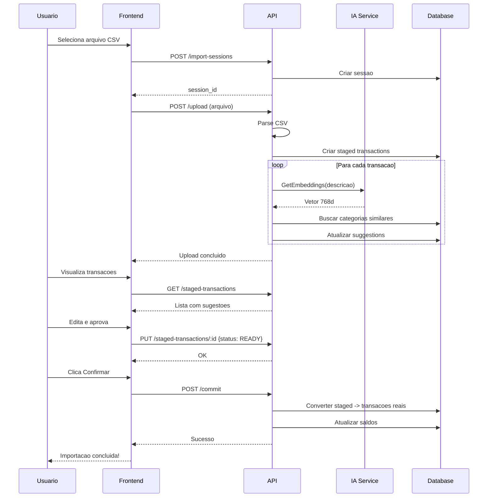

# Import Sessions (Sessoes de Importacao)

Endpoints para importar transacoes em lote via arquivos CSV.

## Endpoints

| Metodo | Endpoint | Descricao |
|--------|----------|-----------|
| GET | `/import-sessions` | Listar sessoes |
| POST | `/import-sessions` | Criar sessao |
| GET | `/import-sessions/:id` | Obter sessao |
| DELETE | `/import-sessions/:id` | Deletar sessao |
| POST | `/import-sessions/:id/upload` | Upload de arquivo |
| GET | `/import-sessions/:id/suggestions` | Obter sugestoes IA |
| POST | `/import-sessions/:id/commit` | Confirmar importacao |
| POST | `/import-sessions/:id/close` | Fechar sessao |
| POST | `/import-sessions/:id/bind` | Vincular recorrentes |

## Staged Transactions

| Metodo | Endpoint | Descricao |
|--------|----------|-----------|
| POST | `/import-sessions/:id/staged-transactions` | Criar staged |
| GET | `/import-sessions/:id/staged-transactions` | Listar staged |
| DELETE | `/import-sessions/:id/staged-transactions` | Deletar todas |
| GET | `/staged-transactions/:id` | Obter staged |
| PUT | `/staged-transactions/:id` | Atualizar staged |
| DELETE | `/staged-transactions/:id` | Deletar staged |

---

## Criar Sessao de Importacao

```http
POST /api/v1/import-sessions
Authorization: Bearer {token}
X-Workspace-ID: {workspace_id}
Content-Type: application/json
```

### Para Conta Bancaria

```json
{
  "account_id": "acc-123-456",
  "description": "Extrato Nubank Janeiro 2024"
}
```

### Para Cartao de Credito

```json
{
  "card_id": "card-123-456",
  "billing_month": "2024-01",
  "target_value": 3500.00,
  "description": "Fatura Nubank Janeiro"
}
```

**Campos:**

| Campo | Tipo | Obrigatorio | Descricao |
|-------|------|-------------|-----------|
| `account_id` | UUID | Condicional | ID da conta (se for conta) |
| `card_id` | UUID | Condicional | ID do cartao (se for cartao) |
| `billing_month` | string | Se cartao | Mes da fatura (YYYY-MM) |
| `target_value` | number | Nao | Valor esperado (para validacao) |
| `description` | string | Nao | Descricao da sessao |

**Response (201 Created):**

```json
{
  "id": "sess-123-456",
  "workspace_id": "ws-123-456",
  "user_id": "user-123",
  "description": "Extrato Nubank Janeiro 2024",
  "account_id": "acc-123-456",
  "card_id": null,
  "billing_month": null,
  "target_value": null,
  "created_at": "2024-01-25T10:00:00Z"
}
```

---

## Upload de Arquivo

```http
POST /api/v1/import-sessions/:id/upload
Authorization: Bearer {token}
X-Workspace-ID: {workspace_id}
Content-Type: multipart/form-data
```

**Form Data:**

```
file: [arquivo.csv]
```

**Formato CSV Esperado:**

```csv
data,descricao,valor
2024-01-15,SUPERMERCADO EXTRA,-150.50
2024-01-16,PIX RECEBIDO JOAO,500.00
2024-01-17,UBER *TRIP,-25.90
```

**Response (200 OK):**

```json
{
  "message": "File uploaded successfully",
  "transactions_created": 3,
  "session_id": "sess-123-456"
}
```

---

## Listar Staged Transactions

```http
GET /api/v1/import-sessions/:id/staged-transactions
Authorization: Bearer {token}
X-Workspace-ID: {workspace_id}
```

**Response (200 OK):**

```json
[
  {
    "id": "st-001",
    "session_id": "sess-123-456",
    "type": "EXPENSE",
    "status": "PENDING",
    "transaction_date": "2024-01-15",
    "amount": 150.50,
    "data": {
      "description": "SUPERMERCADO EXTRA",
      "suggested_description": "Supermercado Extra",
      "suggested_category_id": "cat-alimentacao",
      "suggested_subcategory_id": "subcat-supermercado",
      "confidence": 0.92
    },
    "line_number": 1
  },
  {
    "id": "st-002",
    "session_id": "sess-123-456",
    "type": "INCOME",
    "status": "PENDING",
    "transaction_date": "2024-01-16",
    "amount": 500.00,
    "data": {
      "description": "PIX RECEBIDO JOAO",
      "suggested_description": "PIX Recebido - Joao",
      "suggested_category_id": null,
      "confidence": 0.45
    },
    "line_number": 2
  }
]
```

---

## Obter Sugestoes da IA

```http
GET /api/v1/import-sessions/:id/suggestions
Authorization: Bearer {token}
X-Workspace-ID: {workspace_id}
```

**Response (200 OK):**

```json
{
  "suggestions": [
    {
      "staged_transaction_id": "st-001",
      "original_description": "SUPERMERCADO EXTRA 123",
      "suggested_description": "Supermercado Extra",
      "suggested_category": {
        "id": "cat-alimentacao",
        "name": "Alimentacao"
      },
      "suggested_subcategory": {
        "id": "subcat-supermercado",
        "name": "Supermercado"
      },
      "confidence": 0.92
    }
  ]
}
```

---

## Atualizar Staged Transaction

```http
PUT /api/v1/staged-transactions/:id
Authorization: Bearer {token}
X-Workspace-ID: {workspace_id}
Content-Type: application/json
```

**Request Body:**

```json
{
  "status": "READY",
  "data": {
    "description": "Supermercado Extra",
    "category_id": "cat-alimentacao",
    "subcategory_id": "subcat-supermercado"
  }
}
```

**Response (200 OK):**

```json
{
  "id": "st-001",
  "session_id": "sess-123-456",
  "type": "EXPENSE",
  "status": "READY",
  "transaction_date": "2024-01-15",
  "amount": 150.50,
  "data": {
    "description": "Supermercado Extra",
    "category_id": "cat-alimentacao",
    "subcategory_id": "subcat-supermercado"
  },
  "line_number": 1
}
```

---

## Commit da Sessao

```http
POST /api/v1/import-sessions/:id/commit
Authorization: Bearer {token}
X-Workspace-ID: {workspace_id}
```

**Response (200 OK):**

```json
{
  "message": "Import session committed successfully",
  "transactions_imported": 3,
  "incomes": 1,
  "expenses": 2,
  "transfers": 0
}
```

**O que acontece:**
1. Staged transactions com status `READY` sao processadas
2. Cada uma e convertida para Income, Expense, etc.
3. Saldos de contas sao atualizados
4. Sessao e marcada como finalizada

---

## Modelo de Dados

### ImportSession

```typescript
interface ImportSession {
  id: string;
  workspace_id: string;
  user_id: string;
  description?: string;
  account_id?: string;
  card_id?: string;
  billing_month?: string;      // YYYY-MM
  target_value?: number;
  created_at: string;
}
```

### StagedTransaction

```typescript
interface StagedTransaction {
  id: string;
  session_id: string;
  type: StagedTransactionType;
  status: StagedTransactionStatus;
  transaction_date: string;    // YYYY-MM-DD
  amount: number;
  data: Record<string, any>;   // JSON flexivel
  line_number?: number;
}

type StagedTransactionType =
  | 'INCOME'
  | 'EXPENSE'
  | 'TRANSFER'
  | 'INVESTMENT_DEPOSIT'
  | 'INVESTMENT_WITHDRAWAL'
  | 'CARD_PAYMENT'
  | 'CARD_EXPENSE'
  | 'CARD_CHARGEBACK';

type StagedTransactionStatus =
  | 'QUEUED'      // Na fila para processamento
  | 'PROCESSING'  // Sendo processada pela IA
  | 'COMPLETED'   // Processamento concluido
  | 'PENDING'     // Aguardando revisao do usuario
  | 'READY';      // Pronta para commit
```

---

## Fluxo Completo



---

## Exemplos

### cURL - Fluxo Completo

```bash
# 1. Criar sessao
SESSION=$(curl -s -X POST http://localhost:8080/api/v1/import-sessions \
  -H "Authorization: Bearer $TOKEN" \
  -H "X-Workspace-ID: $WORKSPACE" \
  -H "Content-Type: application/json" \
  -d '{"account_id": "'$ACCOUNT_ID'"}' | jq -r '.id')

# 2. Upload arquivo
curl -X POST "http://localhost:8080/api/v1/import-sessions/$SESSION/upload" \
  -H "Authorization: Bearer $TOKEN" \
  -H "X-Workspace-ID: $WORKSPACE" \
  -F "file=@extrato.csv"

# 3. Listar staged
curl -X GET "http://localhost:8080/api/v1/import-sessions/$SESSION/staged-transactions" \
  -H "Authorization: Bearer $TOKEN" \
  -H "X-Workspace-ID: $WORKSPACE"

# 4. Commit
curl -X POST "http://localhost:8080/api/v1/import-sessions/$SESSION/commit" \
  -H "Authorization: Bearer $TOKEN" \
  -H "X-Workspace-ID: $WORKSPACE"
```

### JavaScript

```javascript
// Criar sessao
const { data: session } = await api.post('/import-sessions', {
  account_id: accountId,
  description: 'Extrato Janeiro'
});

// Upload arquivo
const formData = new FormData();
formData.append('file', file);
await api.post(`/import-sessions/${session.id}/upload`, formData, {
  headers: { 'Content-Type': 'multipart/form-data' }
});

// Obter sugestoes
const { data: suggestions } = await api.get(
  `/import-sessions/${session.id}/suggestions`
);

// Aprovar transacoes
for (const st of stagedTransactions) {
  await api.put(`/staged-transactions/${st.id}`, {
    status: 'READY',
    data: {
      ...st.data,
      category_id: selectedCategory
    }
  });
}

// Commit
await api.post(`/import-sessions/${session.id}/commit`);
```
