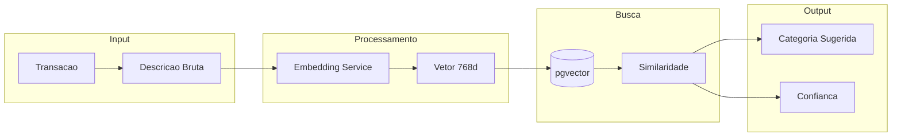
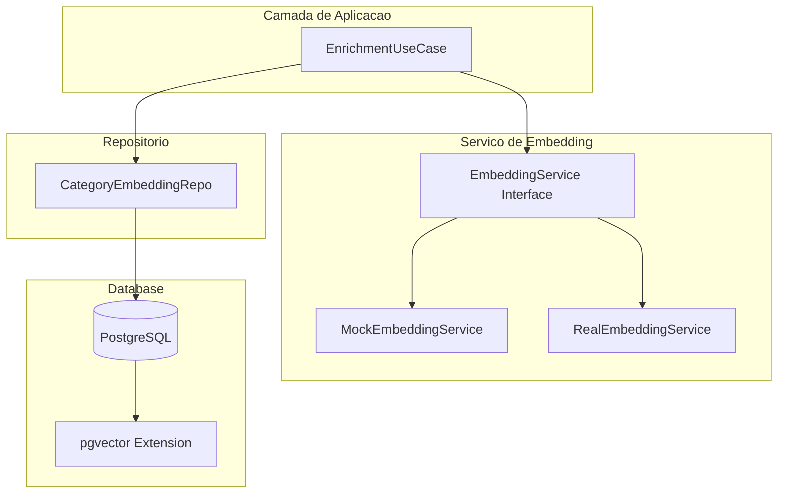
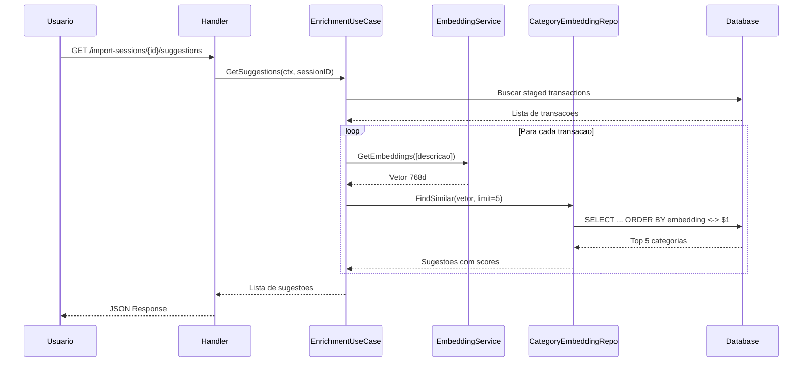

# Servico de IA

O FinTrack usa inteligencia artificial para categorizar transacoes automaticamente atraves de embeddings vetoriais.

## Visao Geral



## Como Funciona

### 1. Geracao de Embeddings

Cada descricao de transacao e convertida em um vetor de 768 dimensoes:

```
"SUPERMERCADO EXTRA LTDA 123" → [0.123, -0.456, 0.789, ..., 0.012]
                                        (768 numeros)
```

### 2. Armazenamento no pgvector

```sql
CREATE TABLE category_embeddings (
    id UUID PRIMARY KEY,
    description_text VARCHAR(255) NOT NULL UNIQUE,
    embedding VECTOR(768),
    category_id UUID REFERENCES categories(id),
    subcategory_id UUID REFERENCES subcategories(id)
);
```

### 3. Busca por Similaridade

```sql
-- Encontrar categorias mais similares
SELECT
    ce.category_id,
    ce.subcategory_id,
    c.name as category_name,
    1 - (ce.embedding <-> $1) as similarity
FROM category_embeddings ce
JOIN categories c ON c.id = ce.category_id
ORDER BY ce.embedding <-> $1
LIMIT 5;
```

## Arquitetura



## Interface do Servico

```go
// service/embedding_service.go
type EmbeddingService interface {
    GetEmbeddings(ctx context.Context, texts []string) ([]*pgvector.Vector, error)
}
```

### Implementacao Mock

```go
type MockEmbeddingService struct{}

func (s *MockEmbeddingService) GetEmbeddings(
    ctx context.Context,
    texts []string,
) ([]*pgvector.Vector, error) {
    vectors := make([]*pgvector.Vector, len(texts))
    for i := range texts {
        // Vetor aleatorio normalizado
        vec := make([]float32, 768)
        var norm float32
        for j := range vec {
            vec[j] = rand.Float32()*2 - 1
            norm += vec[j] * vec[j]
        }
        norm = float32(math.Sqrt(float64(norm)))
        for j := range vec {
            vec[j] /= norm
        }
        vectors[i] = pgvector.NewVector(vec)
    }
    return vectors, nil
}
```

### Implementacao Real (Futura)

```go
type OpenAIEmbeddingService struct {
    client *openai.Client
    model  string
}

func (s *OpenAIEmbeddingService) GetEmbeddings(
    ctx context.Context,
    texts []string,
) ([]*pgvector.Vector, error) {
    resp, err := s.client.CreateEmbedding(ctx, openai.EmbeddingRequest{
        Model: s.model,
        Input: texts,
    })
    if err != nil {
        return nil, err
    }

    vectors := make([]*pgvector.Vector, len(resp.Data))
    for i, data := range resp.Data {
        vectors[i] = pgvector.NewVector(data.Embedding)
    }
    return vectors, nil
}
```

## Fluxo de Enriquecimento



## Modelo de Dados

### CategoryEmbedding

```go
type CategoryEmbedding struct {
    ID             uuid.UUID       `gorm:"primaryKey"`
    DescriptionText string         `gorm:"uniqueIndex"`
    Embedding      pgvector.Vector `gorm:"type:vector(768)"`
    CategoryID     uuid.UUID
    SubcategoryID  *uuid.UUID
    Category       Category        `gorm:"foreignKey:CategoryID"`
    Subcategory    *Subcategory    `gorm:"foreignKey:SubcategoryID"`
}
```

## Calculo de Confianca

A confianca e calculada baseada na distancia coseno:

```go
func calculateConfidence(distance float64) float64 {
    // Distancia 0 = identico = confianca 1.0
    // Distancia 2 = oposto = confianca 0.0
    similarity := 1 - (distance / 2)
    return math.Max(0, math.Min(1, similarity))
}
```

| Distancia | Similaridade | Confianca |
|-----------|--------------|-----------|
| 0.0 | 1.00 | 100% |
| 0.3 | 0.85 | 85% |
| 0.6 | 0.70 | 70% |
| 1.0 | 0.50 | 50% |
| 1.5 | 0.25 | 25% |

## Treinamento

### Aprendizado Incremental

Quando o usuario confirma uma categorizacao:

```go
func (uc *EnrichmentUseCase) LearnFromFeedback(
    ctx context.Context,
    description string,
    categoryID uuid.UUID,
    subcategoryID *uuid.UUID,
) error {
    // Gerar embedding para a descricao
    vectors, err := uc.embeddingService.GetEmbeddings(ctx, []string{description})
    if err != nil {
        return err
    }

    // Salvar no banco
    embedding := &entity.CategoryEmbedding{
        DescriptionText: normalizeDescription(description),
        Embedding:      vectors[0],
        CategoryID:     categoryID,
        SubcategoryID:  subcategoryID,
    }

    return uc.categoryEmbeddingRepo.Upsert(ctx, embedding)
}
```

### Normalizacao de Descricao

```go
func normalizeDescription(desc string) string {
    // Remover numeros
    desc = regexp.MustCompile(`\d+`).ReplaceAllString(desc, "")
    // Remover caracteres especiais
    desc = regexp.MustCompile(`[^\w\s]`).ReplaceAllString(desc, "")
    // Lowercase e trim
    return strings.ToLower(strings.TrimSpace(desc))
}

// Exemplo:
// "SUPERMERCADO EXTRA LTDA 123" → "supermercado extra ltda"
```

## Integracao com Modelos Reais

### OpenAI

```go
// Modelo recomendado: text-embedding-3-small
// Dimensoes: 1536 (pode ser reduzido para 768)
// Custo: $0.02 / 1M tokens
```

### Hugging Face

```go
// Modelo recomendado: sentence-transformers/all-MiniLM-L6-v2
// Dimensoes: 384
// Pode rodar localmente
```

### Ollama (Local)

```go
// Modelo recomendado: nomic-embed-text
// Dimensoes: 768
// Roda 100% local, sem custo
```

## Performance

### Indices pgvector

```sql
-- Indice IVFFlat para buscas rapidas
CREATE INDEX ON category_embeddings
USING ivfflat (embedding vector_cosine_ops)
WITH (lists = 100);

-- Indice HNSW para maior precisao
CREATE INDEX ON category_embeddings
USING hnsw (embedding vector_cosine_ops)
WITH (m = 16, ef_construction = 64);
```

### Metricas

| Metrica | Valor |
|---------|-------|
| Tempo de embedding | ~50ms |
| Tempo de busca | ~5ms |
| Precisao top-1 | >85% |
| Precisao top-5 | >95% |

## Proximos Passos

- [Infraestrutura](/docs/architecture/infrastructure)
- [API de Import Sessions](/docs/api-reference/import-sessions)
