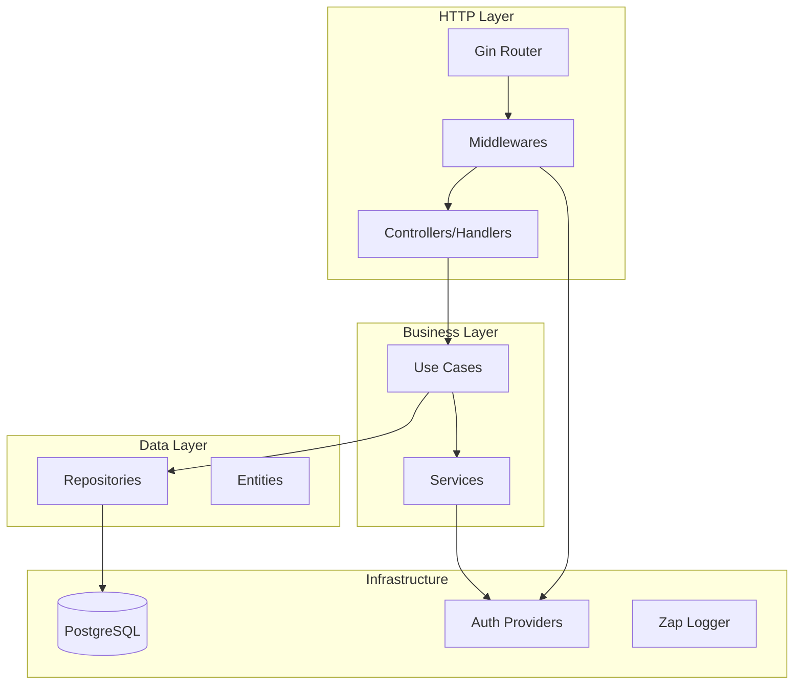
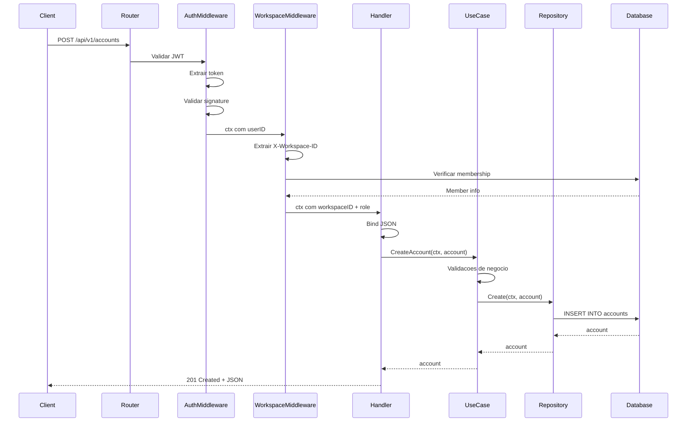

# Arquitetura do Backend

O backend do FinTrack e construido em Go com o framework Gin, seguindo Clean Architecture.

## Visao Geral



## Estrutura de Pastas

```
backend/
├── cmd/
│   └── app/
│       ├── main.go           # Entry point
│       └── docs/             # Swagger docs
├── config/
│   └── config.go             # Configuracao com Viper
├── internal/
│   ├── app/
│   │   └── app.go            # Inicializacao
│   ├── controller/
│   │   └── http/
│   │       ├── v1/           # API v1 handlers
│   │       │   ├── router.go
│   │       │   ├── auth.go
│   │       │   ├── account.go
│   │       │   └── ...
│   │       └── middleware/
│   │           ├── auth_middleware.go
│   │           ├── jwt.go
│   │           └── workspace_middleware.go
│   ├── entity/               # Domain models
│   │   ├── user.go
│   │   ├── workspace.go
│   │   ├── account.go
│   │   └── ...
│   ├── infra/
│   │   └── auth/             # Auth providers
│   │       ├── native_provider.go
│   │       └── github_provider.go
│   ├── service/
│   │   └── embedding_service.go
│   └── usecase/
│       ├── interfaces.go     # Interfaces
│       ├── account.go
│       ├── workspace.go
│       └── repo/             # Repository implementations
│           ├── account_postgres.go
│           └── ...
├── pkg/                      # Shared packages
│   ├── contextutil/
│   ├── httpserver/
│   ├── logger/
│   └── postgres/
├── go.mod
└── Makefile
```

## Camadas da Arquitetura

### 1. Controllers (HTTP Handlers)

Responsabilidade: Receber requests HTTP, validar input, chamar use cases.

```go
// controller/http/v1/account.go
type accountRoutes struct {
    uc  usecase.AccountUseCase
    log *zap.Logger
}

func (r *accountRoutes) create(c *gin.Context) {
    var req CreateAccountRequest
    if err := c.ShouldBindJSON(&req); err != nil {
        c.JSON(http.StatusBadRequest, gin.H{"error": err.Error()})
        return
    }

    account, err := r.uc.CreateAccount(c.Request.Context(), req.ToEntity())
    if err != nil {
        r.log.Error("Failed to create account", zap.Error(err))
        c.JSON(http.StatusInternalServerError, gin.H{"error": "Internal error"})
        return
    }

    c.JSON(http.StatusCreated, account)
}
```

### 2. Use Cases

Responsabilidade: Logica de negocio, orquestracao de operacoes.

```go
// usecase/account.go
type AccountUseCase struct {
    repo AccountRepo
    log  *zap.Logger
}

func (uc *AccountUseCase) CreateAccount(ctx context.Context, acc *entity.Account) (*entity.Account, error) {
    // Validacoes de negocio
    if acc.InitialBalance < 0 {
        return nil, errors.New("initial balance cannot be negative")
    }

    // Chamar repository
    return uc.repo.Create(ctx, acc)
}
```

### 3. Repositories

Responsabilidade: Acesso a dados, queries SQL via GORM.

```go
// usecase/repo/account_postgres.go
type AccountPostgres struct {
    db  *gorm.DB
    log *zap.Logger
}

func (r *AccountPostgres) Create(ctx context.Context, acc *entity.Account) (*entity.Account, error) {
    if err := r.db.WithContext(ctx).Create(acc).Error; err != nil {
        return nil, fmt.Errorf("failed to create account: %w", err)
    }
    return acc, nil
}

func (r *AccountPostgres) List(ctx context.Context, workspaceID uuid.UUID) ([]entity.Account, error) {
    var accounts []entity.Account
    err := r.db.WithContext(ctx).
        Where("workspace_id = ?", workspaceID).
        Preload("Currency").
        Find(&accounts).Error
    return accounts, err
}
```

### 4. Entities

Responsabilidade: Modelos de dominio com tags GORM.

```go
// entity/account.go
type Account struct {
    ID             uuid.UUID    `gorm:"type:uuid;default:uuid_generate_v4();primaryKey"`
    WorkspaceID    uuid.UUID    `gorm:"type:uuid;not null"`
    Name           string       `gorm:"type:varchar(100);not null"`
    Type           AccountType  `gorm:"type:account_type;not null"`
    InitialBalance float64      `gorm:"type:numeric(15,2);not null;default:0"`
    CurrencyCode   string       `gorm:"type:varchar(3);not null;default:'BRL'"`
    IsActive       bool         `gorm:"not null;default:true"`
    Currency       Currency     `gorm:"foreignKey:CurrencyCode;references:Code"`
    DeletedAt      *time.Time   `gorm:"index"`
    CreatedAt      time.Time    `gorm:"autoCreateTime"`
    UpdatedAt      time.Time    `gorm:"autoUpdateTime"`
}
```

## Middlewares

### Auth Middleware

```go
func AuthMiddleware(authService usecase.AuthService) gin.HandlerFunc {
    return func(c *gin.Context) {
        // Extrair token do cookie ou header
        token, err := extractToken(c)
        if err != nil {
            c.AbortWithStatusJSON(401, gin.H{"error": "Unauthorized"})
            return
        }

        // Validar token
        userID, err := authService.ValidateToken(token)
        if err != nil {
            c.AbortWithStatusJSON(401, gin.H{"error": "Invalid token"})
            return
        }

        // Injetar userID no contexto
        ctx := contextutil.WithUserID(c.Request.Context(), userID)
        c.Request = c.Request.WithContext(ctx)
        c.Next()
    }
}
```

### Workspace Middleware

```go
func WorkspaceMiddleware(repo usecase.WorkspaceRepo, log *zap.Logger) gin.HandlerFunc {
    return func(c *gin.Context) {
        // Extrair workspace ID do header
        wsID := c.GetHeader("X-Workspace-ID")
        if wsID == "" {
            c.AbortWithStatusJSON(400, gin.H{"error": "X-Workspace-ID required"})
            return
        }

        // Validar acesso
        userID := contextutil.GetUserID(c.Request.Context())
        member, err := repo.GetWorkspaceMember(c.Request.Context(), wsID, userID)
        if err != nil {
            c.AbortWithStatusJSON(403, gin.H{"error": "Access denied"})
            return
        }

        // Injetar no contexto
        ctx := contextutil.WithWorkspaceID(c.Request.Context(), wsID)
        ctx = contextutil.WithRole(ctx, member.Role)
        c.Request = c.Request.WithContext(ctx)
        c.Next()
    }
}
```

## Fluxo de Request



## Provedores de Autenticacao

### Native Provider

```go
type NativeAuthProvider struct {
    userRepo usecase.UserRepo
}

func (p *NativeAuthProvider) HashPassword(password string) (string, error) {
    hash, err := bcrypt.GenerateFromPassword([]byte(password), 12)
    return string(hash), err
}

func (p *NativeAuthProvider) CheckPassword(hash, password string) error {
    return bcrypt.CompareHashAndPassword([]byte(hash), []byte(password))
}
```

### GitHub Provider

```go
type GitHubAuthProvider struct {
    clientID     string
    clientSecret string
    redirectURL  string
    oauth2Config *oauth2.Config
}

func (p *GitHubAuthProvider) GetLoginURL(state string) string {
    return p.oauth2Config.AuthCodeURL(state)
}

func (p *GitHubAuthProvider) Exchange(ctx context.Context, code string) (*UserInfo, error) {
    token, err := p.oauth2Config.Exchange(ctx, code)
    // Fetch user info from GitHub API
    // ...
}
```

## Servico de IA

```go
// service/embedding_service.go
type EmbeddingService interface {
    GetEmbeddings(ctx context.Context, texts []string) ([]*pgvector.Vector, error)
}

type MockEmbeddingService struct{}

func (s *MockEmbeddingService) GetEmbeddings(ctx context.Context, texts []string) ([]*pgvector.Vector, error) {
    vectors := make([]*pgvector.Vector, len(texts))
    for i := range texts {
        // Gerar vetor aleatorio de 768 dimensoes
        vec := make([]float32, 768)
        for j := range vec {
            vec[j] = rand.Float32()
        }
        vectors[i] = pgvector.NewVector(vec)
    }
    return vectors, nil
}
```

## Configuracao

```go
// config/config.go
type Config struct {
    App      AppConfig
    Postgres PostgresConfig
    Auth     AuthConfig
    Server   ServerConfig
}

type AppConfig struct {
    Name      string `mapstructure:"APP_NAME"`
    Version   string `mapstructure:"APP_VERSION"`
    Port      string `mapstructure:"PORT"`
    SecretKey string `mapstructure:"SECRET_KEY"`
    LogLevel  string `mapstructure:"LOG_LEVEL"`
    ApiPrefix string `mapstructure:"API_PREFIX"`
}

func LoadConfig() (*Config, error) {
    viper.AutomaticEnv()
    // Set defaults
    viper.SetDefault("APP_NAME", "FinTrack API Go")
    viper.SetDefault("PORT", "8080")
    // ...
}
```

## Logging

```go
// pkg/logger/logger.go
func NewLogger(level string) (*zap.Logger, error) {
    cfg := zap.NewProductionConfig()
    cfg.Level = zap.NewAtomicLevelAt(parseLevel(level))
    return cfg.Build()
}

// Uso nos handlers
log.Info("Account created",
    zap.String("id", account.ID.String()),
    zap.String("workspace", workspaceID),
)
```

## Proximos Passos

- [Modelo de Dados](/docs/architecture/database)
- [Servico de IA](/docs/architecture/ai-service)
