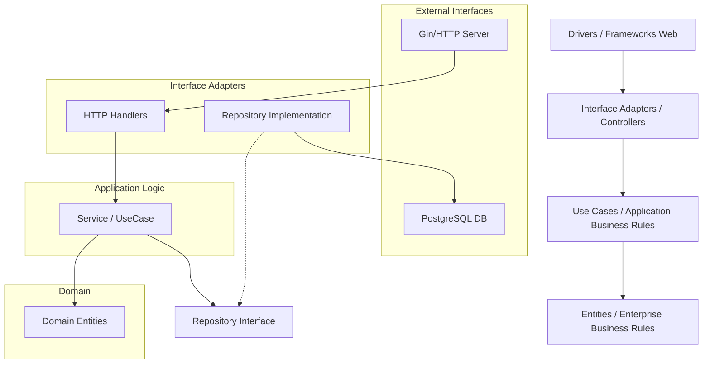

# Arquitetura Backend

O backend do FinTrack é escrito em **Go** e segue estritamente a **Clean Architecture**. Isso garante que a lógica de negócio seja independente de frameworks, banco de dados ou interfaces externas.

## Camadas da Aplicação



## Estrutura de Diretórios (`/backend`)

- **`cmd/app`**: Ponto de entrada (`main.go`). Inicializa dependências e sobe o servidor.
- **`internal/entity`**: Define as estruturas de dados fundamentais (User, Account, Transaction). Não tem dependências externas.
- **`internal/usecase`**: Contém a lógica de negócio. Define interfaces para repositórios.
    - Ex: `CreateTransaction`, `ImportFile`.
- **`internal/controller/http/v1`**: Camada de transporte. Recebe JSON, valida input, chama o UseCase e retorna JSON.
- **`internal/usecase/repo`**: Implementação concreta dos repositórios (PostgreSQL).
- **`pkg/`**: Bibliotecas compartilhadas e utilitários (Logger, Postgres connection).

## Padrão de Repositório

O backend desacopla a lógica do banco de dados através de interfaces.

**Interface (UseCase):**
```go
type AccountRepo interface {
    Create(ctx context.Context, account *entity.Account) error
    GetByID(ctx context.Context, id uuid.UUID) (*entity.Account, error)
}
```

**Implementação (Infrastructure):**
```go
func (r *AccountRepo) Create(ctx context.Context, a *entity.Account) error {
    sql, args, _ := r.Builder.Insert("accounts")...
    _, err := r.Pool.Exec(ctx, sql, args...)
    return err
}
```

## Middleware

- **Auth Middleware**: Valida tokens JWT e extrai o `user_id`.
- **Workspace Middleware**: Garante que o usuário tem acesso ao workspace solicitado no header `X-Workspace-ID`.
