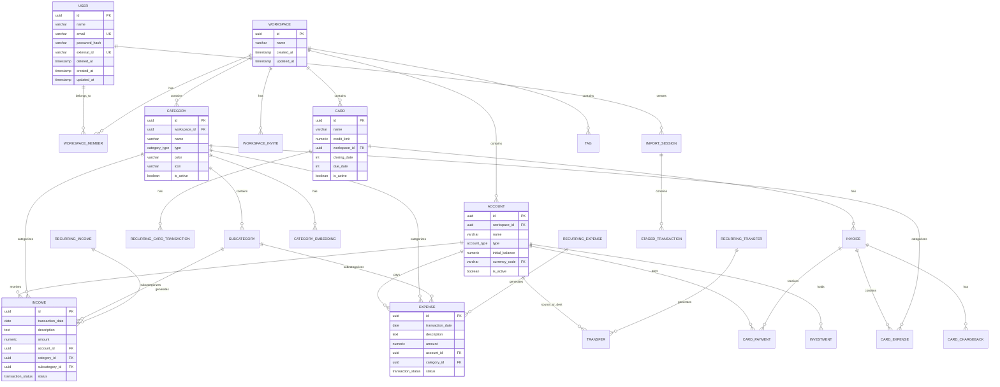

# Arquitetura do Banco de Dados

O FinTrack usa PostgreSQL com extensoes pgvector e uuid-ossp.

## Diagrama ER Completo



## Extensoes PostgreSQL

### uuid-ossp

Geracao de UUIDs:

```sql
CREATE EXTENSION IF NOT EXISTS "uuid-ossp";

-- Uso em tabelas
id UUID DEFAULT uuid_generate_v4() PRIMARY KEY
```

### pgvector

Embeddings vetoriais para IA:

```sql
CREATE EXTENSION IF NOT EXISTS vector;

-- Tabela de embeddings
CREATE TABLE category_embeddings (
    id UUID PRIMARY KEY DEFAULT uuid_generate_v4(),
    description_text VARCHAR(255) NOT NULL UNIQUE,
    embedding VECTOR(768),
    category_id UUID REFERENCES categories(id),
    subcategory_id UUID REFERENCES subcategories(id)
);

-- Busca por similaridade
SELECT category_id, subcategory_id
FROM category_embeddings
ORDER BY embedding <-> $1  -- $1 = vetor de busca
LIMIT 5;
```

## Tipos Enumerados

```sql
-- Tipos de conta
CREATE TYPE account_type AS ENUM (
    'CHECKING', 'SAVINGS', 'WALLET',
    'INVESTMENT', 'CRIPTO', 'CRIPTOWALLET'
);

-- Tipos de categoria
CREATE TYPE category_type AS ENUM ('INCOME', 'EXPENSE');

-- Status de fatura
CREATE TYPE invoice_status AS ENUM ('OPEN', 'PAID', 'OVERDUE');

-- Status de transacao
CREATE TYPE transaction_status AS ENUM (
    'VALIDATING', 'PAID', 'PENDING', 'IGNORE'
);

-- Frequencia de recorrencia
CREATE TYPE transaction_frequency AS ENUM (
    'DAILY', 'WEEKLY', 'BIWEEKLY', 'MONTHLY',
    'BIMONTHLY', 'QUARTERLY', 'YEARLY'
);

-- Tipos de staged transaction
CREATE TYPE staged_transaction_type AS ENUM (
    'INCOME', 'EXPENSE', 'TRANSFER',
    'INVESTMENT_DEPOSIT', 'INVESTMENT_WITHDRAWAL',
    'CARD_PAYMENT', 'CARD_EXPENSE', 'CARD_CHARGEBACK'
);

-- Status de staged transaction
CREATE TYPE staged_transaction_status AS ENUM (
    'QUEUED', 'PROCESSING', 'COMPLETED', 'PENDING', 'READY'
);
```

## Tabelas Principais

### Users

```sql
CREATE TABLE users (
    id UUID PRIMARY KEY DEFAULT uuid_generate_v4(),
    name VARCHAR(100) NOT NULL,
    email VARCHAR(255) NOT NULL UNIQUE,
    password_hash VARCHAR(255),
    external_id VARCHAR(255) UNIQUE,
    deleted_at TIMESTAMP WITH TIME ZONE,
    created_at TIMESTAMP WITH TIME ZONE DEFAULT NOW(),
    updated_at TIMESTAMP WITH TIME ZONE DEFAULT NOW()
);

CREATE INDEX idx_users_external_id ON users(external_id);
```

### Workspaces

```sql
CREATE TABLE workspaces (
    id UUID PRIMARY KEY DEFAULT uuid_generate_v4(),
    name VARCHAR(100) NOT NULL,
    created_at TIMESTAMP WITH TIME ZONE DEFAULT NOW(),
    updated_at TIMESTAMP WITH TIME ZONE DEFAULT NOW()
);

CREATE TABLE workspace_members (
    workspace_id UUID REFERENCES workspaces(id),
    user_id UUID REFERENCES users(id),
    role VARCHAR(50) DEFAULT 'member',
    created_at TIMESTAMP WITH TIME ZONE DEFAULT NOW(),
    PRIMARY KEY (workspace_id, user_id)
);
```

### Accounts

```sql
CREATE TABLE accounts (
    id UUID PRIMARY KEY DEFAULT uuid_generate_v4(),
    workspace_id UUID NOT NULL REFERENCES workspaces(id),
    name VARCHAR(100) NOT NULL,
    type account_type NOT NULL,
    initial_balance NUMERIC(15,2) NOT NULL DEFAULT 0,
    currency_code VARCHAR(3) NOT NULL DEFAULT 'BRL' REFERENCES currencies(code),
    is_active BOOLEAN NOT NULL DEFAULT TRUE,
    deleted_at TIMESTAMP WITH TIME ZONE,
    created_at TIMESTAMP WITH TIME ZONE DEFAULT NOW(),
    updated_at TIMESTAMP WITH TIME ZONE DEFAULT NOW(),
    UNIQUE(workspace_id, name)
);
```

### Transactions

```sql
CREATE TABLE incomes (
    id UUID PRIMARY KEY DEFAULT uuid_generate_v4(),
    transaction_date DATE NOT NULL,
    description TEXT NOT NULL,
    amount NUMERIC(15,2) NOT NULL CHECK (amount > 0),
    account_id UUID NOT NULL REFERENCES accounts(id),
    category_id UUID NOT NULL REFERENCES categories(id),
    subcategory_id UUID REFERENCES subcategories(id),
    recurring_income_id UUID REFERENCES recurring_incomes(id),
    transaction_status transaction_status DEFAULT 'VALIDATING',
    deleted_at TIMESTAMP WITH TIME ZONE,
    created_at TIMESTAMP WITH TIME ZONE DEFAULT NOW(),
    updated_at TIMESTAMP WITH TIME ZONE DEFAULT NOW()
);

CREATE TABLE expenses (
    id UUID PRIMARY KEY DEFAULT uuid_generate_v4(),
    transaction_date DATE NOT NULL,
    description TEXT NOT NULL,
    amount NUMERIC(15,2) NOT NULL CHECK (amount > 0),
    account_id UUID NOT NULL REFERENCES accounts(id),
    category_id UUID NOT NULL REFERENCES categories(id),
    subcategory_id UUID REFERENCES subcategories(id),
    recurring_expense_id UUID REFERENCES recurring_expenses(id),
    transaction_status transaction_status DEFAULT 'VALIDATING',
    deleted_at TIMESTAMP WITH TIME ZONE,
    created_at TIMESTAMP WITH TIME ZONE DEFAULT NOW(),
    updated_at TIMESTAMP WITH TIME ZONE DEFAULT NOW()
);

CREATE TABLE transfers (
    id UUID PRIMARY KEY DEFAULT uuid_generate_v4(),
    transaction_date DATE NOT NULL,
    amount NUMERIC(15,2) NOT NULL CHECK (amount > 0),
    source_account_id UUID NOT NULL REFERENCES accounts(id),
    destination_account_id UUID NOT NULL REFERENCES accounts(id),
    description TEXT,
    transaction_status transaction_status DEFAULT 'VALIDATING',
    recurring_transfer_id UUID REFERENCES recurring_transfers(id),
    deleted_at TIMESTAMP WITH TIME ZONE,
    created_at TIMESTAMP WITH TIME ZONE DEFAULT NOW(),
    updated_at TIMESTAMP WITH TIME ZONE DEFAULT NOW(),
    CHECK (source_account_id != destination_account_id)
);
```

### Cards and Invoices

```sql
CREATE TABLE cards (
    id UUID PRIMARY KEY DEFAULT uuid_generate_v4(),
    name VARCHAR(100) NOT NULL,
    credit_limit NUMERIC(15,2) NOT NULL CHECK (credit_limit >= 0),
    workspace_id UUID NOT NULL REFERENCES workspaces(id),
    closing_date INT NOT NULL CHECK (closing_date BETWEEN 1 AND 31),
    due_date INT NOT NULL CHECK (due_date BETWEEN 1 AND 31),
    is_active BOOLEAN NOT NULL DEFAULT TRUE,
    deleted_at TIMESTAMP WITH TIME ZONE,
    created_at TIMESTAMP WITH TIME ZONE DEFAULT NOW(),
    updated_at TIMESTAMP WITH TIME ZONE DEFAULT NOW(),
    UNIQUE(workspace_id, name),
    CHECK (closing_date != due_date)
);

CREATE TABLE invoices (
    card_id UUID REFERENCES cards(id),
    billing_month VARCHAR(7) NOT NULL, -- YYYY-MM
    status invoice_status DEFAULT 'OPEN',
    created_at TIMESTAMP WITH TIME ZONE DEFAULT NOW(),
    updated_at TIMESTAMP WITH TIME ZONE DEFAULT NOW(),
    PRIMARY KEY (card_id, billing_month)
);

CREATE TABLE card_expenses (
    id UUID PRIMARY KEY DEFAULT uuid_generate_v4(),
    transaction_date DATE NOT NULL,
    description TEXT NOT NULL,
    amount NUMERIC(15,2) NOT NULL CHECK (amount > 0),
    category_id UUID NOT NULL REFERENCES categories(id),
    subcategory_id UUID REFERENCES subcategories(id),
    card_id UUID NOT NULL,
    billing_month VARCHAR(7) NOT NULL,
    recurring_card_transaction_id UUID REFERENCES recurring_card_transactions(id),
    transaction_status transaction_status DEFAULT 'VALIDATING',
    deleted_at TIMESTAMP WITH TIME ZONE,
    created_at TIMESTAMP WITH TIME ZONE DEFAULT NOW(),
    updated_at TIMESTAMP WITH TIME ZONE DEFAULT NOW(),
    FOREIGN KEY (card_id, billing_month) REFERENCES invoices(card_id, billing_month)
);
```

### Import Sessions

```sql
CREATE TABLE import_sessions (
    id UUID PRIMARY KEY DEFAULT uuid_generate_v4(),
    workspace_id UUID NOT NULL REFERENCES workspaces(id),
    user_id UUID NOT NULL REFERENCES users(id),
    description VARCHAR(255),
    account_id UUID REFERENCES accounts(id),
    card_id UUID REFERENCES cards(id),
    billing_month VARCHAR(7),
    target_value NUMERIC(15,2),
    created_at TIMESTAMP WITH TIME ZONE DEFAULT NOW()
);

CREATE TABLE staged_transactions (
    id UUID PRIMARY KEY DEFAULT uuid_generate_v4(),
    session_id UUID NOT NULL REFERENCES import_sessions(id),
    type staged_transaction_type,
    status staged_transaction_status DEFAULT 'PENDING',
    transaction_date DATE NOT NULL,
    amount NUMERIC(15,2) NOT NULL,
    data JSONB NOT NULL,
    line_number INT
);
```

## Indices

```sql
-- Users
CREATE INDEX idx_users_email ON users(email);
CREATE INDEX idx_users_external_id ON users(external_id);

-- Accounts
CREATE INDEX idx_accounts_workspace ON accounts(workspace_id);

-- Transactions
CREATE INDEX idx_incomes_account ON incomes(account_id);
CREATE INDEX idx_incomes_date ON incomes(transaction_date);
CREATE INDEX idx_expenses_account ON expenses(account_id);
CREATE INDEX idx_expenses_date ON expenses(transaction_date);

-- Categories
CREATE INDEX idx_categories_workspace ON categories(workspace_id);
CREATE INDEX idx_categories_type ON categories(type);

-- Embeddings
CREATE INDEX idx_embeddings_description ON category_embeddings(description_text);
```

## Constraints

### Check Constraints

```sql
-- Valores positivos
CHECK (amount > 0)
CHECK (credit_limit >= 0)
CHECK (initial_balance >= 0)

-- Datas validas
CHECK (closing_date BETWEEN 1 AND 31)
CHECK (due_date BETWEEN 1 AND 31)
CHECK (end_date >= start_date OR end_date IS NULL)

-- Validacoes de negocio
CHECK (source_account_id != destination_account_id)
CHECK (closing_date != due_date)

-- Formato de cor
CHECK (color ~ '^#[0-9A-Fa-f]{6}$')
```

### Foreign Keys

Todas as referencias usam `ON DELETE` apropriado:

| Referencia | Acao |
|------------|------|
| workspace_id | CASCADE |
| account_id | RESTRICT |
| category_id | RESTRICT |
| user_id | SET NULL |

## Proximos Passos

- [Servico de IA](/docs/architecture/ai-service)
- [Infraestrutura](/docs/architecture/infrastructure)
