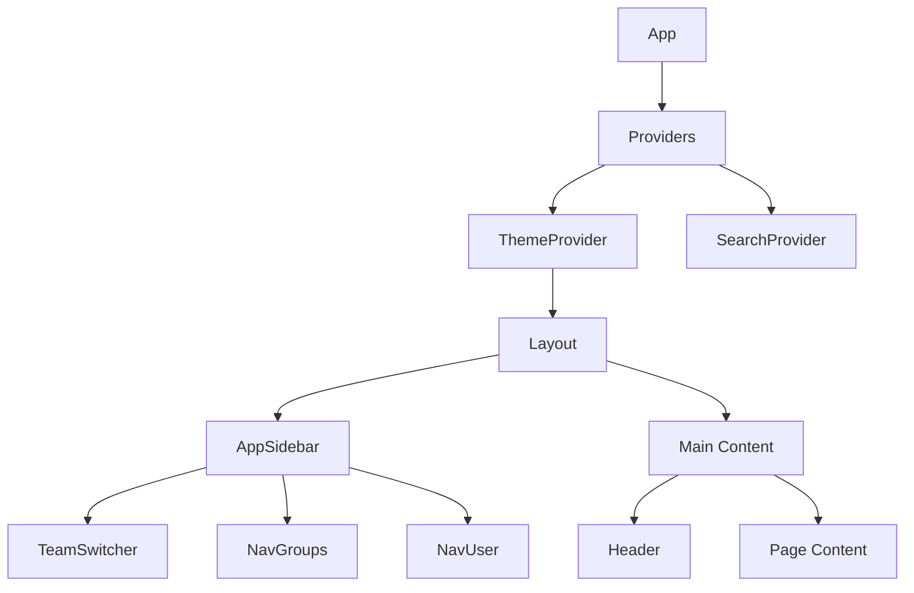

# Arquitetura do Frontend

O frontend do FinTrack e construido com Next.js 15 usando o App Router e React 19.

## Visao Geral


## Estrutura de Pastas

```
frontend/src/
├── app/                    # Next.js App Router
│   ├── layout.tsx          # Root layout
│   ├── providers.tsx       # Global providers
│   ├── globals.css         # Estilos globais
│   ├── (auth)/             # Grupo de rotas auth
│   │   ├── login/
│   │   ├── register/
│   │   └── forgot-password/
│   ├── (dashboard)/        # Grupo de rotas dashboard
│   │   ├── layout.tsx      # Dashboard layout
│   │   ├── users/
│   │   ├── settings/
│   │   ├── import-sessions/
│   │   └── developers/
│   └── (errors)/           # Paginas de erro
│       ├── 401/
│       ├── 403/
│       ├── 404/
│       └── 503/
├── components/
│   ├── ui/                 # shadcn/ui components
│   ├── layout/             # Sidebar, Header, Nav
│   └── errors/             # Error components
├── hooks/                  # Custom hooks
├── lib/                    # Utilitarios
└── public/                 # Assets estaticos
```

## App Router

### Route Groups

Os parenteses `()` criam grupos de rotas sem afetar a URL:

```
(auth)      -> /login, /register, /forgot-password
(dashboard) -> /, /users, /settings
(errors)    -> /401, /403, /404
```

### Layouts

```typescript
// app/layout.tsx - Root Layout
export default function RootLayout({ children }) {
  return (
    <html lang="pt-BR">
      <body>
        <Providers>{children}</Providers>
      </body>
    </html>
  );
}

// app/(dashboard)/layout.tsx - Dashboard Layout
export default function DashboardLayout({ children }) {
  return (
    <ProtectedRoute>
      <SidebarProvider>
        <AppSidebar />
        <main>{children}</main>
      </SidebarProvider>
    </ProtectedRoute>
  );
}
```

## Componentes

### Hierarquia de Componentes



### UI Components (shadcn/ui)

40+ componentes prontos:

| Categoria | Componentes |
|-----------|-------------|
| Forms | Button, Input, Select, Checkbox, Switch |
| Layout | Card, Dialog, Sheet, Tabs |
| Data | Table, Badge, Avatar |
| Feedback | Toast, Alert, Progress |
| Navigation | Dropdown, Command, Breadcrumb |

### Custom Components

| Componente | Proposito |
|------------|-----------|
| `ProtectedRoute` | Wrapper de autenticacao |
| `ThemeSwitch` | Toggle dark/light mode |
| `DateRangePicker` | Selecao de periodo |
| `DataTable` | Tabela com sort/filter/pagination |
| `ConfirmDialog` | Modal de confirmacao |

## State Management

### Zustand Store

```typescript
// hooks/use-auth.ts
interface AuthState {
  user: User | null;
  workspaces: Workspace[];
  activeWorkspace: Workspace | null;
  isAuthenticated: boolean;
  isLoading: boolean;
  setUser: (user: User | null) => void;
  setWorkspaces: (workspaces: Workspace[]) => void;
  setActiveWorkspace: (workspace: Workspace | null) => void;
  logout: () => void;
}

export const useAuth = create<AuthState>()(
  persist(
    (set) => ({
      user: null,
      workspaces: [],
      activeWorkspace: null,
      isAuthenticated: false,
      isLoading: true,
      setUser: (user) => set({ user, isAuthenticated: !!user }),
      setWorkspaces: (workspaces) => {
        set({ workspaces });
        if (workspaces.length > 0) {
          set({ activeWorkspace: workspaces[0] });
        }
      },
      setActiveWorkspace: (workspace) => set({ activeWorkspace: workspace }),
      logout: () => set({
        user: null,
        workspaces: [],
        activeWorkspace: null,
        isAuthenticated: false
      }),
    }),
    {
      name: 'fintrack-auth',
      partialize: (state) => ({ activeWorkspace: state.activeWorkspace }),
    }
  )
);
```

### React Context

- **ThemeProvider**: Gerencia dark/light mode
- **SearchProvider**: Controla command palette

### React Hook Form

```typescript
const form = useForm<FormData>({
  resolver: zodResolver(formSchema),
  defaultValues: {
    email: '',
    password: '',
  },
});
```

## Comunicacao com API

### Axios Instance

```typescript
// lib/api.ts
const api = axios.create({
  baseURL: `${process.env.NEXT_PUBLIC_API_BASE_URL}${process.env.NEXT_PUBLIC_API_PREFIX}`,
  withCredentials: true,
  headers: {
    'Content-Type': 'application/json',
  },
});

// Request interceptor - adiciona workspace header
api.interceptors.request.use((config) => {
  const workspace = useAuth.getState().activeWorkspace;
  if (workspace) {
    config.headers['X-Workspace-ID'] = workspace.id;
  }
  return config;
});

// Response interceptor - handle 401
api.interceptors.response.use(
  (response) => response,
  (error) => {
    if (error.response?.status === 401) {
      useAuth.getState().logout();
      window.location.href = '/login';
    }
    return Promise.reject(error);
  }
);
```

## Estilizacao

### Tailwind CSS v4

```css
/* globals.css */
@import "tailwindcss";

@theme inline {
  --color-background: var(--background);
  --color-foreground: var(--foreground);
  /* ... */
}

:root {
  --background: 0 0% 100%;
  --foreground: 0 0% 3.9%;
  --primary: 0 0% 9%;
  /* ... */
}

.dark {
  --background: 0 0% 3.9%;
  --foreground: 0 0% 98%;
  /* ... */
}
```

### Utilitarios

```typescript
// lib/utils.ts
import { clsx, type ClassValue } from 'clsx';
import { twMerge } from 'tailwind-merge';

export function cn(...inputs: ClassValue[]) {
  return twMerge(clsx(inputs));
}
```

## Hooks Customizados

### useAuth

Gerenciamento de autenticacao.

### useAuthCheck

Validacao de sessao no mount.

### useDialogState

Toggle de dialogs com tipagem.

```typescript
const [openDialog, setOpenDialog] = useDialogState<'edit' | 'delete'>();
```

### useIsMobile

Deteccao de viewport mobile.

```typescript
const isMobile = useIsMobile(); // true if < 768px
```

### useToast

Sistema de notificacoes.

```typescript
const { toast } = useToast();
toast({ title: 'Sucesso!', description: 'Operacao concluida.' });
```

## Formularios

### Padrao com React Hook Form + Zod

```typescript
const formSchema = z.object({
  email: z.string().email('Email invalido'),
  password: z.string().min(7, 'Minimo 7 caracteres'),
});

function LoginForm() {
  const form = useForm<z.infer<typeof formSchema>>({
    resolver: zodResolver(formSchema),
  });

  return (
    <Form {...form}>
      <form onSubmit={form.handleSubmit(onSubmit)}>
        <FormField
          control={form.control}
          name="email"
          render={({ field }) => (
            <FormItem>
              <FormLabel>Email</FormLabel>
              <FormControl>
                <Input {...field} />
              </FormControl>
              <FormMessage />
            </FormItem>
          )}
        />
      </form>
    </Form>
  );
}
```

## Performance

### Otimizacoes

1. **React Server Components**: Componentes no servidor
2. **Dynamic Imports**: Lazy loading de paginas
3. **Image Optimization**: next/image
4. **Code Splitting**: Automatico pelo Next.js

### Bundle Size

| Biblioteca | Tamanho |
|------------|---------|
| React | ~40KB |
| Zustand | ~1KB |
| Recharts | ~100KB |
| Tailwind | CSS-only |

## Proximos Passos

- [Arquitetura do Backend](/docs/architecture/backend)
- [Guia de Componentes](/docs/frontend-guide/components)
