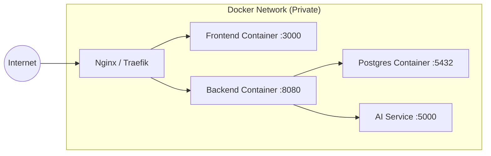

# Infraestrutura

O FinTrack é projetado para ser executado em containers, facilitando o deploy em qualquer ambiente (VPS, Raspberry Pi, Home Server).

## Stack Tecnológica

- **Container Runtime**: Docker
- **Orquestração**: Docker Compose (recomendado para uso pessoal)
- **Banco de Dados**: PostgreSQL 15+ (com extensão `vector` para IA, se necessário)
- **Proxy Reverso**: Nginx ou Traefik (opcional, para SSL e acesso externo)

## Topologia de Rede (Docker Compose)

## Persistência de Dados

Para garantir que dados não sejam perdidos ao reiniciar containers, volumes Docker devem ser mapeados:
- `/var/lib/postgresql/data`: Para persistir o banco de dados.
- Configurações e logs também podem ser persistidos.
