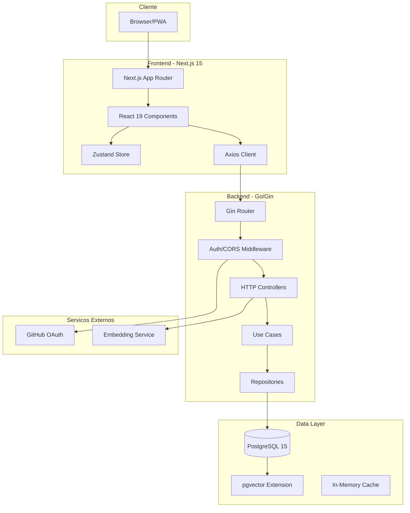
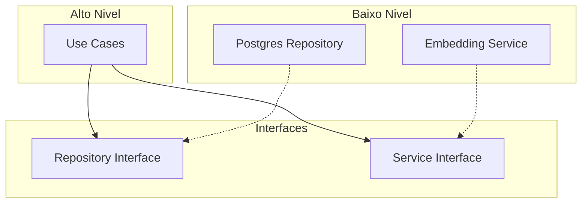
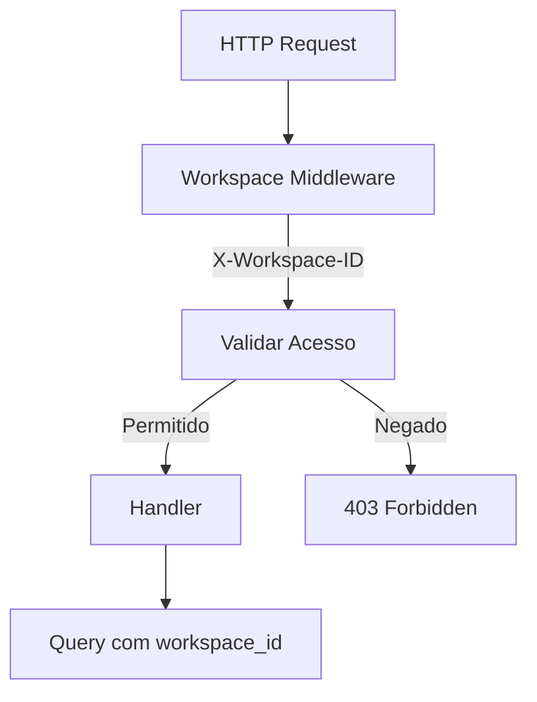
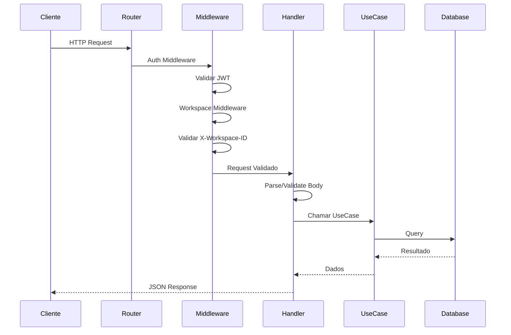
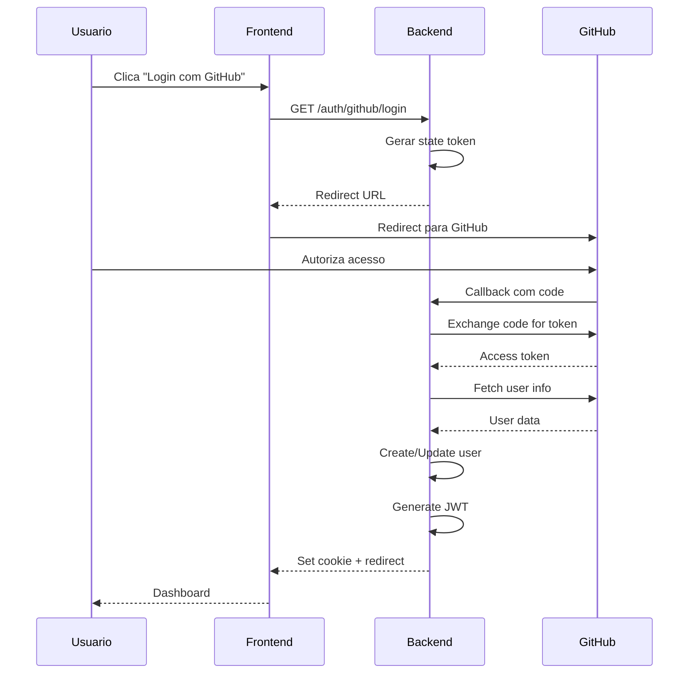
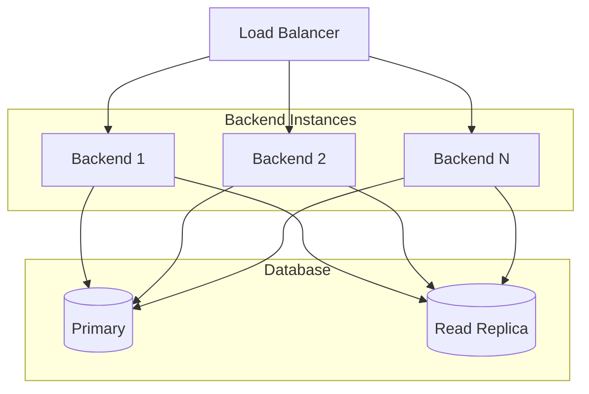

# Visao Geral da Arquitetura

O FinTrack segue uma arquitetura moderna em camadas, separando responsabilidades entre frontend, backend e banco de dados.

## Diagrama de Alto Nivel

## Principios Arquiteturais

### 1. Separacao de Responsabilidades

Cada camada tem uma responsabilidade unica:

| Camada | Responsabilidade |
|--------|------------------|
| **Controllers** | Receber requisicoes HTTP, validar input |
| **Use Cases** | Logica de negocio, orquestracao |
| **Repositories** | Acesso a dados, queries SQL |
| **Entities** | Modelos de dominio |

### 2. Inversao de Dependencias

### 3. Multi-tenancy por Workspace

## Stack Tecnologica

### Frontend

| Tecnologia | Versao | Proposito |
|------------|--------|-----------|
| Next.js | 15.1.7 | Framework React com SSR |
| React | 19.0.0 | UI Library |
| TypeScript | 5.7.3 | Type Safety |
| Tailwind CSS | 4.0.7 | Styling |
| shadcn/ui | - | Componentes UI |
| Zustand | 5.0.10 | State Management |
| React Hook Form | 7.53.2 | Forms |
| Zod | 3.23.8 | Validacao |
| Recharts | 2.15.1 | Graficos |

### Backend

| Tecnologia | Versao | Proposito |
|------------|--------|-----------|
| Go | 1.24.3 | Linguagem |
| Gin | 1.11.0 | Web Framework |
| GORM | 1.31.1 | ORM |
| JWT | 5.3.0 | Autenticacao |
| Zap | 1.27.1 | Logging |
| Viper | 1.21.0 | Configuracao |

### Banco de Dados

| Tecnologia | Versao | Proposito |
|------------|--------|-----------|
| PostgreSQL | 15+ | Database |
| pgvector | 0.3.0 | Vector Search |
| uuid-ossp | - | UUID Generation |

## Fluxo de Dados

### Requisicao HTTP

### Autenticacao OAuth

## Decisoes Arquiteturais

### Por que Go no Backend?

1. **Performance**: Compilado, baixo consumo de memoria
2. **Concorrencia**: Goroutines para operacoes paralelas
3. **Simplicidade**: Linguagem simples e previsivel
4. **Ecosystem**: Bibliotecas maduras (Gin, GORM)

### Por que Next.js no Frontend?

1. **SSR/SSG**: Melhor SEO e performance inicial
2. **App Router**: Roteamento moderno com layouts
3. **React 19**: Ultimas features do React
4. **Full-stack**: API routes se necessario

### Por que PostgreSQL?

1. **ACID Compliance**: Transacoes confiaveis
2. **pgvector**: Suporte nativo a embeddings
3. **JSON Support**: JSONB para dados flexiveis
4. **Maturity**: Decadas de desenvolvimento

### Por que Zustand?

1. **Lightweight**: < 1KB minified
2. **No boilerplate**: API simples
3. **Persist middleware**: localStorage facil
4. **Outside React**: Acessivel em interceptors

## Escalabilidade

### Horizontal

### Vertical

| Componente | Minimo | Recomendado |
|------------|--------|-------------|
| CPU | 1 core | 4 cores |
| RAM | 1 GB | 4 GB |
| Disco | 10 GB | 50 GB SSD |

## Proximos Passos

- [Arquitetura do Frontend](/docs/architecture/frontend)
- [Arquitetura do Backend](/docs/architecture/backend)
- [Modelo de Dados](/docs/architecture/database)
