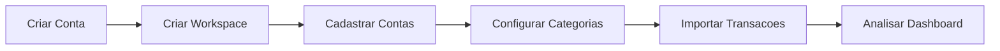
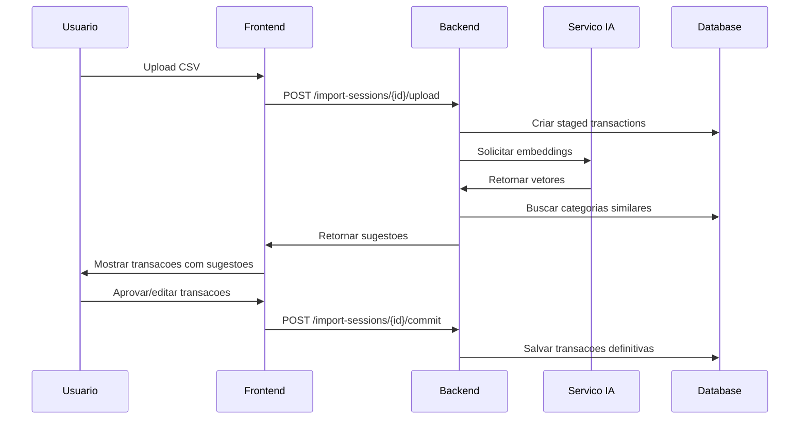

# Primeiros Passos

Apos instalar o FinTrack, siga este guia para comecar a usar o sistema.

## Fluxo Inicial



## 1. Criar sua Conta

### Via Interface Web

1. Acesse http://localhost:3000
2. Clique em "Criar Conta" ou "Entrar com GitHub"
3. Preencha seus dados ou autorize o acesso GitHub
4. Confirme seu cadastro

### Via API (Opcional)

```bash
curl -X POST http://localhost:8080/api/v1/auth/register \
  -H "Content-Type: application/json" \
  -d '{
    "email": "seu@email.com",
    "password": "senha-segura-123",
    "name": "Seu Nome"
  }'
```

## 2. Criar seu Primeiro Workspace

Workspaces sao contextos isolados para organizar suas financas.

### Exemplos de Workspaces

- **Pessoal**: Suas financas individuais
- **Familia**: Financas compartilhadas com parceiro(a)
- **Freelancer**: Receitas e despesas de trabalho autonomo
- **Empresa**: Financas de um pequeno negocio

### Criando via Interface

1. Apos o login, clique em "Novo Workspace"
2. De um nome descritivo
3. Clique em "Criar"

### Criando via API

```bash
curl -X POST http://localhost:8080/api/v1/workspaces \
  -H "Content-Type: application/json" \
  -H "Authorization: Bearer seu-token-jwt" \
  -d '{
    "name": "Financas Pessoais"
  }'
```

## 3. Cadastrar Contas Bancarias

Contas representam onde seu dinheiro esta guardado.

### Tipos de Conta

| Tipo | Descricao | Exemplo |
|------|-----------|---------|
| `CHECKING` | Conta corrente | Banco do Brasil, Nubank |
| `SAVINGS` | Poupanca | Poupanca Caixa |
| `WALLET` | Carteira digital | PicPay, Mercado Pago |
| `INVESTMENT` | Investimentos | Corretora |
| `CRIPTO` | Criptomoedas | Binance, Coinbase |
| `CRIPTOWALLET` | Carteira cripto | MetaMask, Ledger |

### Criando uma Conta

```bash
curl -X POST http://localhost:8080/api/v1/accounts \
  -H "Content-Type: application/json" \
  -H "Authorization: Bearer seu-token-jwt" \
  -H "X-Workspace-ID: seu-workspace-id" \
  -d '{
    "name": "Nubank Conta Corrente",
    "type": "CHECKING",
    "initial_balance": 1500.00,
    "currency_code": "BRL",
    "is_active": true
  }'
```

## 4. Configurar Categorias

Categorias ajudam a classificar suas transacoes.

### Categorias Sugeridas

**Despesas:**
- Alimentacao (Supermercado, Restaurante, Delivery)
- Transporte (Combustivel, Uber, Transporte Publico)
- Moradia (Aluguel, Condominio, Luz, Agua)
- Saude (Farmacia, Medico, Academia)
- Lazer (Cinema, Streaming, Viagens)

**Receitas:**
- Salario
- Freelance
- Investimentos
- Vendas

### Criando uma Categoria

```bash
curl -X POST http://localhost:8080/api/v1/categories \
  -H "Content-Type: application/json" \
  -H "Authorization: Bearer seu-token-jwt" \
  -H "X-Workspace-ID: seu-workspace-id" \
  -d '{
    "name": "Alimentacao",
    "type": "EXPENSE",
    "color": "#FF5733",
    "icon": "utensils"
  }'
```

### Criando Subcategorias

```bash
curl -X POST http://localhost:8080/api/v1/subcategories \
  -H "Content-Type: application/json" \
  -H "Authorization: Bearer seu-token-jwt" \
  -H "X-Workspace-ID: seu-workspace-id" \
  -d '{
    "name": "Supermercado",
    "category_id": "id-da-categoria-alimentacao"
  }'
```

## 5. Importar Transacoes

### Preparar o Arquivo CSV

Exporte o extrato do seu banco em formato CSV. Exemplo de formato:

```csv
data,descricao,valor
2024-01-15,SUPERMERCADO XYZ,-150.50
2024-01-16,TRANSFERENCIA PIX,500.00
2024-01-17,UBER *TRIP,-25.90
```

### Criar Sessao de Importacao

```bash
curl -X POST http://localhost:8080/api/v1/import-sessions \
  -H "Content-Type: application/json" \
  -H "Authorization: Bearer seu-token-jwt" \
  -H "X-Workspace-ID: seu-workspace-id" \
  -d '{
    "account_id": "id-da-conta"
  }'
```

### Upload do Arquivo

```bash
curl -X POST http://localhost:8080/api/v1/import-sessions/{session-id}/upload \
  -H "Authorization: Bearer seu-token-jwt" \
  -H "X-Workspace-ID: seu-workspace-id" \
  -F "file=@extrato.csv"
```

### Revisar Sugestoes

A IA analisa cada transacao e sugere categorias:

```bash
curl -X GET http://localhost:8080/api/v1/import-sessions/{session-id}/suggestions \
  -H "Authorization: Bearer seu-token-jwt" \
  -H "X-Workspace-ID: seu-workspace-id"
```

### Confirmar Importacao

```bash
curl -X POST http://localhost:8080/api/v1/import-sessions/{session-id}/commit \
  -H "Authorization: Bearer seu-token-jwt" \
  -H "X-Workspace-ID: seu-workspace-id"
```

## 6. Visualizar Dashboard

Acesse o dashboard para ver:

- Saldo total por conta
- Grafico de gastos por categoria
- Tendencia de gastos ao longo do tempo
- Transacoes recentes

## Fluxo de Categorizacao com IA



## Proximos Passos

Agora que voce configurou o basico:

1. [Aprenda sobre Workspaces](/docs/user-guide/workspaces)
2. [Configure cartoes de credito](/docs/user-guide/accounts-and-cards)
3. [Explore os dashboards](/docs/user-guide/dashboards)
4. [Configure transacoes recorrentes](/docs/user-guide/categorization)

## Dicas Uteis

### Organizacao

- Crie categorias antes de importar transacoes
- Use subcategorias para maior detalhamento
- Adicione tags para analises transversais

### Seguranca

- Faca backup regular do banco de dados
- Use senhas fortes
- Mantenha o sistema atualizado

### Performance

- Importe extratos mensalmente
- Revise e corrija sugestoes da IA
- A IA aprende com suas correcoes
