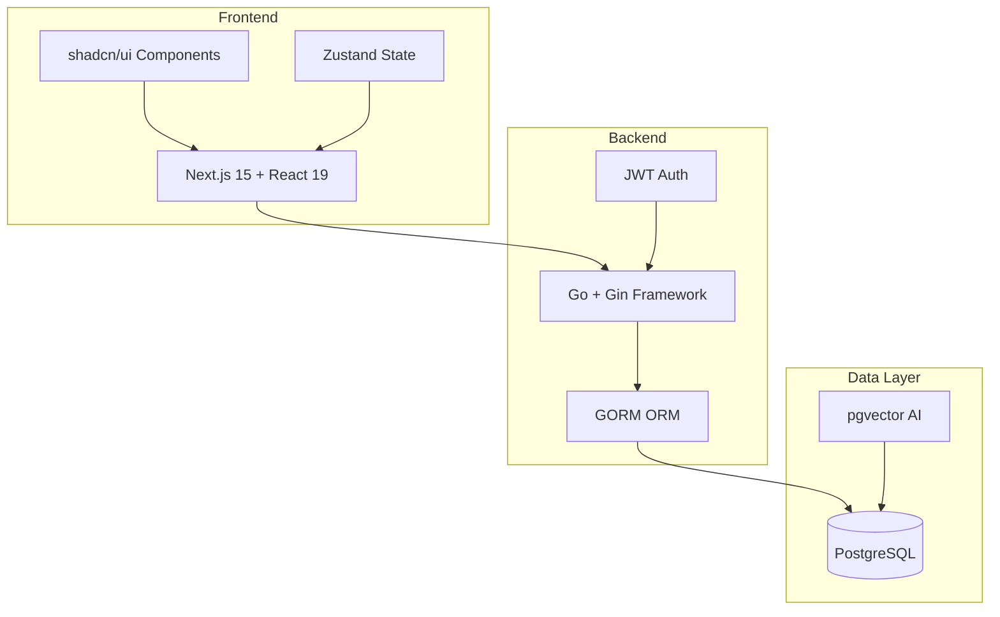
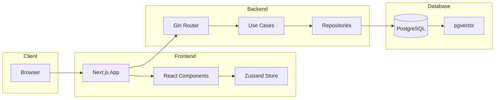

# Introducao ao FinTrack

**FinTrack** e um aplicativo web de gestao de financas pessoais **auto-hospedado**, projetado para automatizar e simplificar o controle financeiro. O sistema permite que usuarios registrem, categorizem e analisem suas transacoes financeiras de forma inteligente, oferecendo insights sobre gastos, receitas e fluxo de caixa.

## Visao Geral

## Principais Funcionalidades

### Gestao de Transacoes
- **Importacao em Lote**: Upload de arquivos CSV exportados de bancos
- **Categorizacao Inteligente**: IA sugere categorias baseado em historico
- **Multi-tipo**: Receitas, despesas, transferencias e cartoes de credito

### Multi-Workspace
- **Contextos Isolados**: Separe financas pessoais, familiares e empresariais
- **Controle de Acesso**: Convide membros com diferentes permissoes
- **Dados Segregados**: Cada workspace mantem seus proprios dados

### Dashboards e Analises
- **Visualizacoes Graficas**: Graficos de barras, linhas e tendencias
- **Filtros Avancados**: Por periodo, categoria, conta ou cartao
- **Exportacao de Relatorios**: Dados em formatos uteis

### Seguranca e Privacidade
- **Auto-hospedado**: Controle total sobre seus dados
- **Autenticacao Segura**: JWT com suporte a OAuth (GitHub)
- **Rede Privada**: Sem exposicao publica obrigatoria

## Stack Tecnologica

| Camada | Tecnologia |
|--------|------------|
| **Frontend** | Next.js 15, React 19, TypeScript, Tailwind CSS 4, shadcn/ui |
| **Backend** | Go 1.24, Gin, GORM |
| **Banco de Dados** | PostgreSQL com pgvector |
| **IA** | Embeddings vetoriais para categorizacao |
| **Auth** | JWT + OAuth2 (GitHub) |

## Por Que FinTrack?

### Problemas que Resolve

1. **Registro Manual Tedioso**: Importacao em lote elimina entrada manual
2. **Categorizacao Inconsistente**: IA padroniza categorias automaticamente
3. **Falta de Visibilidade**: Dashboard centralizado com todas as informacoes
4. **Privacidade de Dados**: Auto-hospedagem garante controle total

### Diferenciais

- **Zero Custo Operacional**: Rode em seu proprio hardware
- **IA Local**: Modelo roda localmente, sem envio de dados externos
- **Codigo Aberto**: Transparencia total e possibilidade de customizacao
- **Design Moderno**: Interface profissional com dark mode

## Proximos Passos

**Para Usuarios:**
- [Instalacao](/docs/getting-started/installation) - Configure o FinTrack
- [Primeiros Passos](/docs/getting-started/first-steps) - Comece a usar
- [Guia do Usuario](/docs/user-guide/workspaces) - Aprenda todas as funcionalidades

**Para Desenvolvedores:**
- [Arquitetura](/docs/architecture/overview) - Entenda o sistema
- [API Reference](/docs/api-reference/authentication) - Integre com a API
- [Contribuicao](/docs/contributing/how-to-contribute) - Colabore com o projeto

## Arquitetura em Alto Nivel

## Metricas de Sucesso

| Metrica | Objetivo |
|---------|----------|
| Tempo de importacao | < 5 minutos por extrato |
| Taxa de acerto da IA | > 85% sem intervencao |
| Transacoes por sessao | 100+ por upload |
| Uptime | 99.9% disponibilidade |
