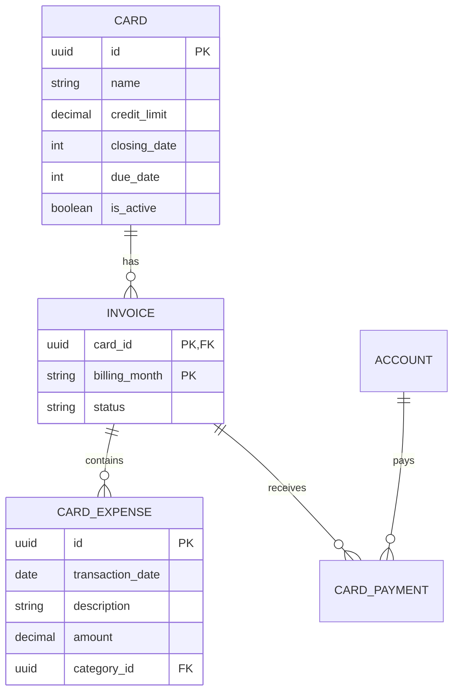
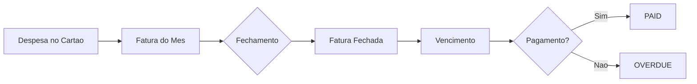
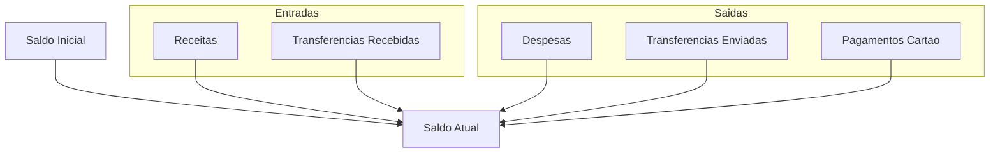

# Contas e Cartoes

O FinTrack diferencia entre **Contas** (onde o dinheiro esta) e **Cartoes de Credito** (meio de pagamento com fatura).

## Contas Bancarias

### Tipos de Conta

| Tipo | Codigo | Descricao |
|------|--------|-----------|
| Conta Corrente | `CHECKING` | Conta bancaria padrao |
| Poupanca | `SAVINGS` | Conta poupanca |
| Carteira Digital | `WALLET` | PicPay, Mercado Pago, etc. |
| Investimentos | `INVESTMENT` | Corretora, CDB, fundos |
| Criptomoedas | `CRIPTO` | Exchange de cripto |
| Carteira Cripto | `CRIPTOWALLET` | Hardware/software wallet |

### Criar Conta

```bash
curl -X POST http://localhost:8080/api/v1/accounts \
  -H "Content-Type: application/json" \
  -H "Authorization: Bearer seu-token-jwt" \
  -H "X-Workspace-ID: workspace-id" \
  -d '{
    "name": "Nubank Conta Corrente",
    "type": "CHECKING",
    "initial_balance": 2500.00,
    "currency_code": "BRL",
    "is_active": true
  }'
```

**Resposta:**

```json
{
  "id": "acc-123-456-789",
  "workspace_id": "ws-123-456",
  "name": "Nubank Conta Corrente",
  "type": "CHECKING",
  "initial_balance": 2500.00,
  "currency_code": "BRL",
  "is_active": true,
  "currency": {
    "code": "BRL",
    "name": "Brazilian Real",
    "symbol": "R$"
  },
  "created_at": "2024-01-15T10:30:00Z",
  "updated_at": "2024-01-15T10:30:00Z"
}
```

### Listar Contas

```bash
curl -X GET http://localhost:8080/api/v1/accounts \
  -H "Authorization: Bearer seu-token-jwt" \
  -H "X-Workspace-ID: workspace-id"
```

## Cartoes de Credito

Cartoes possuem caracteristicas especiais:

- **Limite de credito**
- **Data de fechamento** da fatura
- **Data de vencimento** do pagamento
- **Faturas mensais** com despesas agrupadas

### Modelo de Cartao



### Ciclo da Fatura



### Status da Fatura

| Status | Descricao |
|--------|-----------|
| `OPEN` | Fatura aberta, aceitando novas despesas |
| `PAID` | Fatura paga integralmente |
| `OVERDUE` | Fatura vencida sem pagamento |

### Exemplo de Fluxo

1. **Dia 1-25**: Despesas vao para fatura de Janeiro
2. **Dia 25 (fechamento)**: Fatura de Janeiro fecha
3. **Dia 26-25**: Despesas vao para fatura de Fevereiro
4. **Dia 10 (vencimento)**: Pagamento da fatura de Janeiro

## Moedas Suportadas

O FinTrack suporta multiplas moedas:

| Codigo | Nome | Simbolo |
|--------|------|---------|
| BRL | Real Brasileiro | R$ |
| USD | Dolar Americano | $ |
| EUR | Euro | E |
| GBP | Libra Esterlina | £ |

### Listar Moedas

```bash
curl -X GET http://localhost:8080/api/v1/currencies \
  -H "Authorization: Bearer seu-token-jwt"
```

## Saldo de Conta

O saldo e calculado como:

```
Saldo = Saldo Inicial + Receitas - Despesas + Transferencias Recebidas - Transferencias Enviadas - Pagamentos de Cartao
```

### Componentes do Saldo



## Boas Praticas

### Contas
- Cadastre todas as contas que voce usa regularmente
- Use o tipo correto para cada conta
- Defina o saldo inicial corretamente

### Cartoes
- Configure as datas de fechamento e vencimento corretas
- Importe os extratos do cartao regularmente
- Registre os pagamentos de fatura

### Organizacao
- Use nomes descritivos (ex: "Nubank - Conta Principal")
- Desative contas que nao usa mais
- Mantenha apenas contas relevantes ativas

## Proximos Passos

- [Importar transacoes](/docs/user-guide/importing-transactions)
- [Configurar categorias](/docs/user-guide/categorization)
