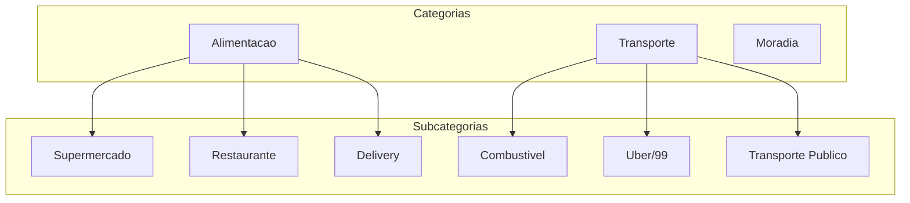
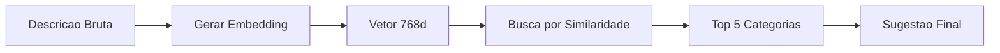

# Categorizacao

O sistema de categorizacao do FinTrack usa inteligencia artificial para automatizar a classificacao de transacoes.

## Hierarquia de Categorias



## Tipos de Categoria

| Tipo | Descricao | Exemplos |
|------|-----------|----------|
| `INCOME` | Receitas | Salario, Freelance, Investimentos |
| `EXPENSE` | Despesas | Alimentacao, Transporte, Lazer |

## Criar Categoria

```bash
curl -X POST http://localhost:8080/api/v1/categories \
  -H "Content-Type: application/json" \
  -H "Authorization: Bearer seu-token-jwt" \
  -H "X-Workspace-ID: workspace-id" \
  -d '{
    "name": "Alimentacao",
    "type": "EXPENSE",
    "color": "#FF5733",
    "icon": "utensils",
    "is_active": true
  }'
```

**Resposta:**

```json
{
  "id": "cat-123-456",
  "workspace_id": "ws-123",
  "name": "Alimentacao",
  "type": "EXPENSE",
  "color": "#FF5733",
  "icon": "utensils",
  "is_active": true,
  "subcategories": [],
  "created_at": "2024-01-15T10:30:00Z"
}
```

## Criar Subcategoria

```bash
curl -X POST http://localhost:8080/api/v1/subcategories \
  -H "Content-Type: application/json" \
  -H "Authorization: Bearer seu-token-jwt" \
  -H "X-Workspace-ID: workspace-id" \
  -d '{
    "name": "Supermercado",
    "category_id": "cat-123-456",
    "is_active": true
  }'
```

## Sistema de IA

### Como Funciona



### Embeddings Vetoriais

O FinTrack usa vetores de 768 dimensoes para representar descricoes:

```sql
-- Busca por similaridade usando pgvector
SELECT category_id, subcategory_id
FROM category_embeddings
ORDER BY embedding <-> query_embedding
LIMIT 5;
```

### Aprendizado Continuo

1. **Usuario importa transacao**: "SUPERMERCADO XYZ LTDA 123"
2. **IA sugere**: Alimentacao > Supermercado (85% confianca)
3. **Usuario confirma ou corrige**
4. **Sistema aprende**: Proximas transacoes similares terao melhor sugestao

## Categorias Recomendadas

### Despesas (EXPENSE)

| Categoria | Subcategorias Sugeridas | Icone |
|-----------|-------------------------|-------|
| Alimentacao | Supermercado, Restaurante, Delivery, Padaria | utensils |
| Transporte | Combustivel, Uber/99, Transporte Publico, Estacionamento | car |
| Moradia | Aluguel, Condominio, Luz, Agua, Gas, Internet | home |
| Saude | Farmacia, Medico, Dentista, Academia | heart |
| Educacao | Cursos, Livros, Material Escolar | book |
| Lazer | Cinema, Streaming, Viagens, Jogos | gamepad |
| Vestuario | Roupas, Calcados, Acessorios | shirt |
| Servicos | Assinaturas, Manutencao, Limpeza | wrench |

### Receitas (INCOME)

| Categoria | Subcategorias Sugeridas | Icone |
|-----------|-------------------------|-------|
| Salario | CLT, PJ, Bonus, 13o | briefcase |
| Freelance | Projetos, Consultoria | laptop |
| Investimentos | Dividendos, Juros, Rendimentos | trending-up |
| Vendas | Produtos, Servicos | shopping-cart |
| Outros | Presentes, Reembolsos | gift |

## Tags

Tags permitem classificacoes transversais:

```bash
curl -X POST http://localhost:8080/api/v1/tags \
  -H "Content-Type: application/json" \
  -H "Authorization: Bearer seu-token-jwt" \
  -H "X-Workspace-ID: workspace-id" \
  -d '{
    "name": "Trabalho",
    "color": "#0066FF"
  }'
```

### Exemplos de Tags

- **Trabalho**: Despesas relacionadas ao trabalho
- **Viagem**: Gastos em viagens especificas
- **Saude**: Todos os gastos com saude
- **Emergencia**: Gastos nao planejados

## Transacoes Recorrentes

Configure transacoes que se repetem:

### Frequencias Disponiveis

| Frequencia | Descricao |
|------------|-----------|
| `DAILY` | Diario |
| `WEEKLY` | Semanal |
| `BIWEEKLY` | Quinzenal |
| `MONTHLY` | Mensal |
| `BIMONTHLY` | Bimestral |
| `QUARTERLY` | Trimestral |
| `YEARLY` | Anual |

### Criar Receita Recorrente

```bash
curl -X POST http://localhost:8080/api/v1/recurring-incomes \
  -H "Content-Type: application/json" \
  -H "Authorization: Bearer seu-token-jwt" \
  -H "X-Workspace-ID: workspace-id" \
  -d '{
    "description": "Salario",
    "amount": 5000.00,
    "account_id": "conta-uuid",
    "category_id": "cat-salario",
    "frequency": "MONTHLY",
    "start_date": "2024-01-05",
    "is_active": true
  }'
```

### Criar Despesa Recorrente

```bash
curl -X POST http://localhost:8080/api/v1/recurring-expenses \
  -H "Content-Type: application/json" \
  -H "Authorization: Bearer seu-token-jwt" \
  -H "X-Workspace-ID: workspace-id" \
  -d '{
    "description": "Netflix",
    "amount": 39.90,
    "account_id": "conta-uuid",
    "category_id": "cat-lazer",
    "subcategory_id": "subcat-streaming",
    "frequency": "MONTHLY",
    "start_date": "2024-01-15",
    "is_active": true
  }'
```

## Boas Praticas

### Categorias
- Crie categorias amplas (maximo 10-15)
- Use subcategorias para detalhamento
- Mantenha consistencia na nomenclatura

### Subcategorias
- Seja especifico mas nao excessivo
- Agrupe itens relacionados
- Revise periodicamente

### Tags
- Use para analises transversais
- Nao substitua categorias por tags
- Mantenha poucas tags ativas

## Proximos Passos

- [Visualize os dashboards](/docs/user-guide/dashboards)
- [Gere relatorios](/docs/user-guide/reports)
