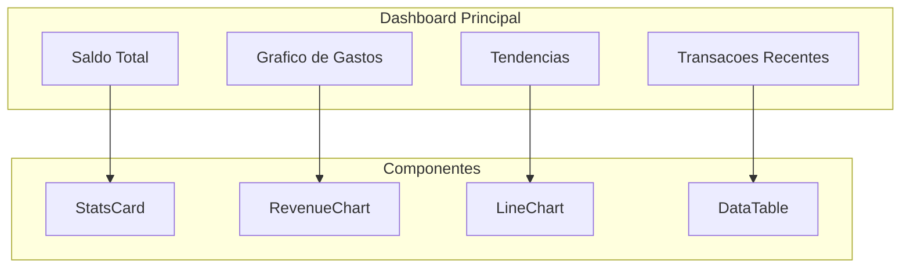
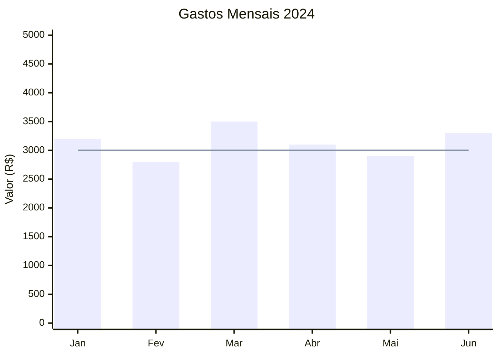

# Dashboards

O FinTrack oferece dashboards interativos para visualizar suas financas de forma clara e intuitiva.

## Visao Geral



## Componentes do Dashboard

### Cards de Estatisticas

Exibem metricas principais:

- **Saldo Total**: Soma de todas as contas
- **Receitas do Mes**: Total de entradas
- **Despesas do Mes**: Total de saidas
- **Economia**: Receitas - Despesas

### Grafico de Gastos por Categoria

Visualizacao em barras ou pizza mostrando distribuicao:

```
Alimentacao    ████████████████░░░░  40%
Transporte     ██████░░░░░░░░░░░░░░  15%
Moradia        ████████████░░░░░░░░  30%
Lazer          ██████░░░░░░░░░░░░░░  15%
```

### Grafico de Tendencia

Evolucao ao longo do tempo:



### Transacoes Recentes

Tabela com ultimas movimentacoes:

| Data | Descricao | Categoria | Valor |
|------|-----------|-----------|-------|
| 15/01 | Supermercado Extra | Alimentacao | -R$ 250,00 |
| 14/01 | Uber | Transporte | -R$ 35,00 |
| 13/01 | Salario | Receita | +R$ 5.000,00 |

## Variantes de Dashboard

O FinTrack oferece 3 layouts de dashboard:

### Dashboard 1 - Visao Geral
- Cards de resumo no topo
- Grafico de receitas e despesas
- Atividades recentes

### Dashboard 2 - Analitico
- Metricas detalhadas
- Grafico de visitantes/acessos
- Analise de tendencias

### Dashboard 3 - Operacional
- Foco em transacoes
- Tabelas interativas
- Acoes rapidas

## Filtros Disponiveis

### Por Periodo

```typescript
// Opcoes de periodo
- Hoje
- Ultimos 7 dias
- Ultimos 30 dias
- Este mes
- Mes passado
- Este ano
- Personalizado (data inicio - data fim)
```

### Por Conta

Filtre transacoes de uma conta especifica:

```
[x] Nubank Conta Corrente
[x] Bradesco Poupanca
[ ] Carteira Bitcoin
```

### Por Categoria

Selecione categorias especificas:

```
[x] Alimentacao
[x] Transporte
[ ] Lazer
[ ] Moradia
```

## Tecnologias de Visualizacao

O frontend usa **Recharts** para graficos:

### BarChart (Grafico de Barras)

```typescript
import { BarChart, Bar, XAxis, YAxis, Tooltip } from 'recharts';

const data = [
  { name: 'Jan', despesas: 3200, receitas: 5000 },
  { name: 'Fev', despesas: 2800, receitas: 5000 },
  // ...
];

<BarChart data={data}>
  <XAxis dataKey="name" />
  <YAxis />
  <Tooltip />
  <Bar dataKey="despesas" fill="#ef4444" />
  <Bar dataKey="receitas" fill="#22c55e" />
</BarChart>
```

### LineChart (Grafico de Linha)

```typescript
import { LineChart, Line, XAxis, YAxis, Tooltip } from 'recharts';

<LineChart data={data}>
  <XAxis dataKey="date" />
  <YAxis />
  <Tooltip />
  <Line type="monotone" dataKey="saldo" stroke="#3b82f6" />
</LineChart>
```

## Metricas Calculadas

### Saldo de Conta

```
Saldo = Saldo Inicial
      + SUM(Receitas)
      - SUM(Despesas)
      + SUM(Transferencias Recebidas)
      - SUM(Transferencias Enviadas)
      - SUM(Pagamentos de Cartao)
```

### Economia Mensal

```
Economia = Receitas do Mes - Despesas do Mes
```

### Taxa de Economia

```
Taxa = (Economia / Receitas) * 100
```

## Responsividade

Os dashboards se adaptam a diferentes telas:

| Tela | Layout |
|------|--------|
| Desktop (>1024px) | Grid 2-3 colunas |
| Tablet (768-1024px) | Grid 1-2 colunas |
| Mobile (<768px) | Stack vertical |

## Dark Mode

O sistema suporta tema claro e escuro:

- Deteccao automatica da preferencia do sistema
- Toggle manual no cabecalho
- Persistencia no localStorage

### Cores do Tema

| Elemento | Claro | Escuro |
|----------|-------|--------|
| Background | #ffffff | #0a0a0a |
| Foreground | #0a0a0a | #fafafa |
| Primary | #0f172a | #f8fafc |
| Card | #ffffff | #0a0a0a |

## Performance

### Otimizacoes

- **React Server Components**: Renderizacao no servidor
- **Lazy Loading**: Componentes carregados sob demanda
- **Memoization**: Calculos pesados cacheados
- **Virtualizacao**: Tabelas grandes otimizadas

### Metricas de Performance

| Metrica | Objetivo |
|---------|----------|
| First Contentful Paint | < 1.5s |
| Largest Contentful Paint | < 2.5s |
| Time to Interactive | < 3s |

## Proximos Passos

- [Gere relatorios personalizados](/docs/user-guide/reports)
- [Entenda a arquitetura](/docs/architecture/overview)
