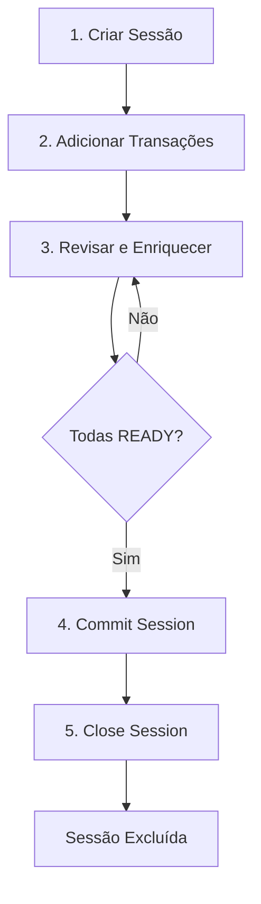

# Sessão de Importação (Import Session)

A **Sessão de Importação** é uma funcionalidade central do FinTrack que permite importar, revisar e categorizar transações em uma área de staging segura antes de afetar os saldos oficiais das contas ou cartões.

## Conceito

Uma **Session** funciona como uma área de staging atrelada a um **Workspace**. Nela, você pode manipular transações livremente sem impactar o saldo final das contas ou as tabelas principais do banco de dados.

### Informações Principais de uma Transação

Cada transação possui três informações essenciais:
- **`transaction_date`**: Data da transação
- **`description`**: Descrição da transação
- **`amount`**: Valor da transação

## Contextos de Importação

Cada sessão pode ter dois tipos de contexto, sendo **obrigatório** informar o `billing_month` referente ao mês ou fatura:

### Contexto de Cartão (`card_id`)

Para importação de despesas de cartão de crédito ou lançamentos de estorno na fatura.

**Tipos de transação disponíveis:**
| Tipo | Descrição |
|------|-----------|
| `CARD_EXPENSE` | Despesa de cartão (valor positivo) |
| `CARD_CHARGEBACK` | Estorno de cartão (valor negativo) |

As despesas podem ser vinculadas a transações recorrentes da tabela de **Recurring Card Expenses**.

### Contexto de Conta (`account_id`)

Para importação de transações de conta corrente, poupança e outros.

**Tipos de transação disponíveis:**
| Tipo | Descrição |
|------|-----------|
| `INCOME` | Receita (valor positivo) |
| `EXPENSE` | Despesa (valor negativo) |
| `TRANSFER` | Transferência entre contas |
| `CARD_PAYMENT` | Pagamento de fatura de cartão |
| `INVESTMENT_DEPOSIT` | Depósito em investimentos |
| `INVESTMENT_WITHDRAWAL` | Saque de investimentos |

As transações podem ser vinculadas a **Recurring Incomes**, **Recurring Expenses** e **Recurring Transfers**.

## Campo `data` (JSON)

Cada tipo de transação requer campos específicos para ser salva no banco final. O campo `data` (tipo JSONB) armazena os atributos necessários para cada tipo de transação, como:
- IDs de categoria e subcategoria
- Conta de destino (para transferências)
- ID da transação recorrente vinculada
- Flag `ignore: true` para transações que devem ser ignoradas

## Status das Staged Transactions

| Status | Descrição |
|--------|-----------|
| `READY` | Transação possui todas as informações necessárias para ser salva na base |
| `PENDING` | Faltam informações obrigatórias para salvar na base |
| `PROCESSING` | Transação está sendo processada pela IA para categorização |

## Fluxo de Vida da Sessão



### 1. Criar Sessão

Cria uma nova sessão de importação vinculada ao workspace (obtido do header `x-workspace-id`).

**Requisitos:**
- Informar `account_id` OU `card_id`
- Informar `billing_month`
- `target_value` é opcional (default: 0)

**Para contexto de cartão:**
- O `target_value` padrão deve ser a soma dos pagamentos de cartão para o `card_id` e `billing_month` consultados no banco
- Valida se a fatura existe e está no status `OPEN`
- Se não existir, a fatura é criada com status `OPEN`
- Se existir em outro status, retorna erro 400

**Nome da Sessão:**
O nome é gerado automaticamente: `{Nome da Conta/Cartão} | {billing_month}`

### 2. Adicionar Transações (Staged Transactions)

Crie transações informando `transaction_date`, `description` e `amount`.

**Regra de sinais:**

| Contexto | Valor Positivo | Valor Negativo |
|----------|----------------|----------------|
| Conta | Receita (`INCOME`) | Despesa (`EXPENSE`) |
| Cartão | Despesa (`CARD_EXPENSE`) | Estorno (`CARD_CHARGEBACK`) |

### 3. Revisar e Enriquecer

- Atualizar transações individualmente
- Alterar tipos, categorias e subcategorias
- **Adicionar Tags:**
  - Vincular tags existentes (`tag_ids`)
  - Criar novas tags informando o nome (`tags`) - elas serão criadas automaticamente no workspace
- Vincular a transações recorrentes (recurring transactions)
- Aguardar processamento da IA (status `PROCESSING` → `READY`)

### 4. Commit Session

Salva todas as transações com status `READY` nas tabelas principais do banco de dados:
- Transações são salvas com status `VALIDATING`
- Transações com `ignore: true` no JSON são salvas com status `IGNORE`

### 5. Close Session (Conciliação)

Etapa final e irreversível que:

**Para Contexto de Conta:**
- Altera o status de todas as transações da conta de `VALIDATING` para `PAID`
- Exclui a sessão e todas as staged transactions

**Para Contexto de Cartão:**
- Altera o status das transações do cartão de `VALIDATING` para `PAID`
- Altera o status da fatura para `PAID`
- Exclui a sessão e todas as staged transactions

## Vinculação com Transações Recorrentes

Uma staged transaction pode ser vinculada a uma transação recorrente (recurring) para herdar automaticamente suas configurações.

### Como funciona

O endpoint de bind recebe:
- `staged_transaction_id`: ID da staged transaction a ser vinculada
- `recurring_transaction_id`: ID da transação recorrente

O sistema identifica o tipo de recurring transaction consultando as tabelas na seguinte ordem:

| Tabela | Tipo | Contexto |
|--------|------|----------|
| `recurring_incomes` | Receita recorrente | Conta |
| `recurring_expenses` | Despesa recorrente | Conta |
| `recurring_transfers` | Transferência recorrente | Conta |
| `recurring_card_transactions` | Despesa de cartão recorrente | Cartão |

### Campos herdados

Ao vincular, a staged transaction assume automaticamente:

| Campo | Descrição |
|-------|-----------|
| `type` | Tipo da transação (INCOME, EXPENSE, TRANSFER, CARD_EXPENSE) |
| `description` | Descrição da recorrente |
| `category_id` | Categoria da recorrente |
| `subcategory_id` | Subcategoria (se existir na recorrente) |
| `recurring_*_id` | ID da recorrente vinculada |

### Campos salvos no JSON `data`

Dependendo do tipo de recurring, o campo correspondente é adicionado ao JSON `data`:

| Tipo de Recurring | Campo no JSON |
|-------------------|---------------|
| Recurring Income | `recurring_income_id` |
| Recurring Expense | `recurring_expense_id` |
| Recurring Transfer | `recurring_transfer_id` |
| Recurring Card Transaction | `recurring_card_transaction_id` |

### Exemplo

**Antes do bind:**
```json
{
  "id": "uuid-staged",
  "type": "EXPENSE",
  "status": "PENDING",
  "amount": 49.90,
  "data": {
    "description": "NETFLIX"
  }
}
```

**Request de bind:**
```json
{
  "staged_transaction_id": "uuid-staged",
  "recurring_transaction_id": "uuid-recurring-netflix"
}
```

**Após o bind:**
```json
{
  "id": "uuid-staged",
  "type": "EXPENSE",
  "status": "READY",
  "amount": 49.90,
  "data": {
    "description": "Netflix - Assinatura Mensal",
    "category_id": "uuid-categoria-streaming",
    "subcategory_id": "uuid-subcategoria-video",
    "recurring_expense_id": "uuid-recurring-netflix"
  }
}
```

O status muda para `READY` pois agora a transação possui todos os campos obrigatórios.

## Detalhes da Sessão (Get Session)

Ao consultar uma sessão, são retornadas as seguintes informações:

| Campo | Descrição |
|-------|-----------|
| `name` | Nome da sessão |
| `type` | Tipo (conta ou cartão) |
| `target_value` | Valor alvo para conciliação |
| `initial_balance` | Saldo no início do mês |
| `context_value` | Saldo atual calculado |
| `transactions` | Lista de todas as transações da sessão |
| `stats` | Contagem de transações `READY` vs total |
| `status` | `OK` se todas estão `READY` e `target_value == context_value` (não impeditivo) |

### Cálculo do `initial_balance`

#### Contexto de Conta

O `initial_balance` representa o saldo da conta no **início do mês** especificado no `billing_month`.

**Fórmula:**
```
initial_balance = Soma de todas as transações da conta com data < primeiro dia do billing_month
```

**Tabelas consultadas:**

| Tabela | Operação | Descrição |
|--------|----------|-----------|
| `incomes` | `+ amount` | Receitas somam ao saldo |
| `expenses` | `- amount` | Despesas subtraem do saldo |
| `transfers` | `- amount` (source) | Transferências enviadas subtraem |
| `transfers` | `+ amount` (destination) | Transferências recebidas somam |
| `card_payments` | `- amount` | Pagamentos de cartão subtraem |
| `investment_deposits` | `- amount` | Depósitos em investimento subtraem |
| `investment_withdrawals` | `+ amount` | Saques de investimento somam |

**Exemplo:**
- `billing_month`: `2024-03`
- Transações da conta antes de 01/03/2024:
  - 15/01/2024: +1000.00 (income)
  - 20/01/2024: -200.00 (expense)
  - 10/02/2024: +500.00 (income)
  - 25/02/2024: -150.00 (expense)
- **initial_balance** = 1000 - 200 + 500 - 150 = **R$ 1.150,00**

#### Contexto de Cartão

O `initial_balance` representa o valor da fatura **sem** as staged transactions.

**Fórmula:**
```
initial_balance = card_expenses - card_chargebacks
```

**Tabelas consultadas:**

| Tabela | Operação | Descrição |
|--------|----------|-----------|
| `card_expenses` | `+ amount` | Despesas somam à fatura |
| `card_chargebacks` | `- amount` | Estornos subtraem da fatura |

**Exemplo:**
- `billing_month`: `2024-03`, `card_id`: `uuid-cartao`
- Transações já registradas na fatura:
  - 05/03/2024: +500.00 (card_expense)
  - 10/03/2024: +200.00 (card_expense)
  - 15/03/2024: -50.00 (card_chargeback)
- **initial_balance** = 500 + 200 - 50 = **R$ 650,00**

### Cálculo do `context_value`

#### Contexto de Conta

O `context_value` representa o saldo **atual** da conta, incluindo todas as transações já registradas até a data atual mais as transações da sessão de importação.

**Fórmula:**
```
context_value = initial_balance
              + transações do mês nas tabelas principais
              + staged_transactions da sessão
```

**Regra de sinais para Staged Transactions:**

| Tipo | Operação |
|------|----------|
| `INCOME` | `+ amount` |
| `EXPENSE` | `- amount` |
| `TRANSFER` | `- amount` (source) / `+ amount` (destination) |
| `CARD_PAYMENT` | `- amount` |
| `INVESTMENT_DEPOSIT` | `- amount` |
| `INVESTMENT_WITHDRAWAL` | `+ amount` |

**Exemplo (continuando o anterior):**
- `initial_balance`: R$ 1.150,00
- Transações já registradas em março/2024 (tabelas principais):
  - 05/03/2024: +2000.00 (income)
  - 10/03/2024: -300.00 (expense)
- Transações na sessão de importação (staged_transactions):
  - 15/03/2024: -100.00 (EXPENSE)
  - 20/03/2024: -50.00 (EXPENSE)
- **context_value** = 1150 + 2000 - 300 - 100 - 50 = **R$ 2.700,00**

#### Contexto de Cartão

O `context_value` representa o valor total da fatura incluindo as staged transactions.

**Fórmula:**
```
context_value = initial_balance + staged_transactions da sessão
```
Ou seja:
```
context_value = (card_expenses - card_chargebacks) + staged_transactions
```

**Regra de sinais para Staged Transactions:**

| Tipo | Operação |
|------|----------|
| `CARD_EXPENSE` | `+ amount` |
| `CARD_CHARGEBACK` | `- amount` |

**Exemplo (continuando o anterior):**
- `initial_balance`: R$ 650,00
- Transações na sessão de importação (staged_transactions):
  - 18/03/2024: +150.00 (CARD_EXPENSE)
  - 22/03/2024: +80.00 (CARD_EXPENSE)
- **context_value** = 650 + 150 + 80 = **R$ 880,00**

### Conciliação

A conciliação é considerada bem-sucedida quando:
```
target_value == context_value
```

Isso indica que o saldo calculado pelo sistema corresponde ao saldo esperado (extrato bancário). Essa validação **não é impeditiva** para fechar a sessão, servindo apenas como indicador para o usuário.

## Entidades do Banco de Dados

### ImportSession

```typescript
interface ImportSession {
  id: uuid;              // Identificador único
  workspace_id: uuid;    // Workspace ao qual pertence
  user_id: uuid;         // Usuário que criou
  description: string;   // Nome da sessão
  account_id?: uuid;     // ID da conta (se contexto de conta)
  card_id?: uuid;        // ID do cartão (se contexto de cartão)
  billing_month: string; // Mês de referência (YYYY-MM)
  target_value: number;  // Valor alvo para conciliação
  created_at: timestamp; // Data de criação
}
```

### StagedTransaction

```typescript
interface StagedTransaction {
  id: uuid;                    // Identificador único
  session_id: uuid;            // ID da sessão pai
  type: StagedTransactionType; // Tipo da transação
  status: StagedTransactionStatus; // Status atual
  transaction_date: date;      // Data da transação
  amount: number;              // Valor
  data: jsonb;                 // Metadados adicionais
  line_number: number;         // Número da linha do arquivo importado
}
```

## Resumo dos Endpoints

| Operação | Endpoint | Descrição |
|----------|----------|-----------|
| Criar Sessão | `POST /import-sessions` | Cria nova sessão |
| Listar Sessões | `GET /import-sessions` | Lista sessões do workspace |
| Obter Sessão | `GET /import-sessions/:id` | Detalhes da sessão com contexto |
| Excluir Sessão | `DELETE /import-sessions/:id` | Remove sessão e transações |
| Criar Transações | `POST /import-sessions/:id/staged-transactions` | Cria transações em lote |
| Excluir Todas | `DELETE /import-sessions/:id/staged-transactions` | Remove todas as transações |
| Commit | `POST /import-sessions/:id/commit` | Efetiva transações |
| Close | `POST /import-sessions/:id/close` | Concilia e encerra |
| Vincular Recorrente | `POST /import-sessions/:id/bind` | Vincula a recurring |
| Obter Transação | `GET /staged-transactions/:id` | Detalhes da transação |
| Atualizar Transação | `PUT /staged-transactions/:id` | Atualiza transação |

Para detalhes técnicos dos endpoints, consulte a [API Reference](/docs/api-reference/import-sessions).
