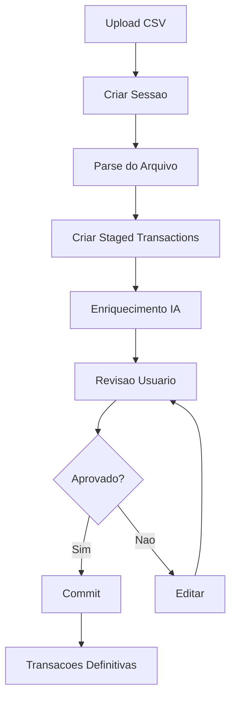
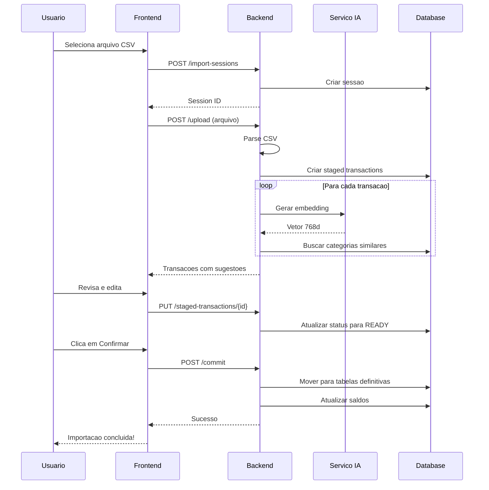

# Importando Transacoes

O processo de importacao permite adicionar multiplas transacoes de uma vez a partir de extratos bancarios.

## Fluxo de Importacao



## Sessoes de Importacao

Uma sessao de importacao e um ambiente temporario onde as transacoes sao preparadas antes de se tornarem definitivas.

### Estados da Sessao

| Estado | Descricao |
|--------|-----------|
| Aberta | Aceitando uploads e edicoes |
| Fechada | Nao aceita mais modificacoes |
| Committed | Transacoes foram confirmadas |

### Criar Sessao

```bash
curl -X POST http://localhost:8080/api/v1/import-sessions \
  -H "Content-Type: application/json" \
  -H "Authorization: Bearer seu-token-jwt" \
  -H "X-Workspace-ID: workspace-id" \
  -d '{
    "account_id": "conta-uuid",
    "description": "Extrato Janeiro 2024"
  }'
```

Para cartoes de credito:

```bash
curl -X POST http://localhost:8080/api/v1/import-sessions \
  -H "Content-Type: application/json" \
  -H "Authorization: Bearer seu-token-jwt" \
  -H "X-Workspace-ID: workspace-id" \
  -d '{
    "card_id": "cartao-uuid",
    "billing_month": "2024-01",
    "target_value": 3500.00
  }'
```

## Upload de Arquivo

### Formato CSV Esperado

```csv
data,descricao,valor
2024-01-15,SUPERMERCADO EXTRA,-150.50
2024-01-16,PIX RECEBIDO JOAO,500.00
2024-01-17,UBER *TRIP,-25.90
2024-01-18,SALARIO EMPRESA XYZ,5000.00
```

### Colunas Obrigatorias

| Coluna | Formato | Descricao |
|--------|---------|-----------|
| `data` | YYYY-MM-DD | Data da transacao |
| `descricao` | Texto | Descricao original |
| `valor` | Decimal | Negativo = saida, Positivo = entrada |

### Enviar Arquivo

```bash
curl -X POST http://localhost:8080/api/v1/import-sessions/{id}/upload \
  -H "Authorization: Bearer seu-token-jwt" \
  -H "X-Workspace-ID: workspace-id" \
  -F "file=@extrato-janeiro.csv"
```

## Staged Transactions

Transacoes temporarias aguardando revisao.

### Status das Staged Transactions

| Status | Descricao |
|--------|-----------|
| `QUEUED` | Aguardando processamento |
| `PROCESSING` | Sendo processada pela IA |
| `COMPLETED` | Processamento concluido |
| `PENDING` | Aguardando revisao do usuario |
| `READY` | Pronta para commit |

### Tipos de Transacao

| Tipo | Descricao |
|------|-----------|
| `INCOME` | Receita (entrada de dinheiro) |
| `EXPENSE` | Despesa (saida de conta) |
| `TRANSFER` | Transferencia entre contas |
| `CARD_EXPENSE` | Despesa no cartao de credito |
| `CARD_PAYMENT` | Pagamento de fatura |
| `CARD_CHARGEBACK` | Estorno no cartao |
| `INVESTMENT_DEPOSIT` | Aporte em investimento |
| `INVESTMENT_WITHDRAWAL` | Resgate de investimento |

### Listar Staged Transactions

```bash
curl -X GET http://localhost:8080/api/v1/import-sessions/{id}/staged-transactions \
  -H "Authorization: Bearer seu-token-jwt" \
  -H "X-Workspace-ID: workspace-id"
```

### Editar Staged Transaction

```bash
curl -X PUT http://localhost:8080/api/v1/staged-transactions/{id} \
  -H "Content-Type: application/json" \
  -H "Authorization: Bearer seu-token-jwt" \
  -H "X-Workspace-ID: workspace-id" \
  -d '{
    "status": "READY",
    "data": {
      "description": "Supermercado Extra",
      "category_id": "cat-uuid",
      "subcategory_id": "subcat-uuid"
    }
  }'
```

## Sugestoes da IA

O sistema usa embeddings vetoriais para sugerir categorias.

### Obter Sugestoes

```bash
curl -X GET http://localhost:8080/api/v1/import-sessions/{id}/suggestions \
  -H "Authorization: Bearer seu-token-jwt" \
  -H "X-Workspace-ID: workspace-id"
```

**Resposta:**

```json
{
  "suggestions": [
    {
      "staged_transaction_id": "st-123",
      "original_description": "SUPERMERCADO EXTRA 123",
      "suggested_description": "Supermercado Extra",
      "suggested_category": {
        "id": "cat-alimentacao",
        "name": "Alimentacao"
      },
      "suggested_subcategory": {
        "id": "subcat-supermercado",
        "name": "Supermercado"
      },
      "confidence": 0.92
    }
  ]
}
```

### Nivel de Confianca

| Nivel | Valor | Acao Recomendada |
|-------|-------|------------------|
| Alto | > 0.85 | Aceitar automaticamente |
| Medio | 0.60-0.85 | Revisar rapidamente |
| Baixo | < 0.60 | Revisar cuidadosamente |

## Commit da Sessao

Apos revisar todas as transacoes:

```bash
curl -X POST http://localhost:8080/api/v1/import-sessions/{id}/commit \
  -H "Authorization: Bearer seu-token-jwt" \
  -H "X-Workspace-ID: workspace-id"
```

### O Que Acontece no Commit

1. Transacoes `READY` sao movidas para tabelas definitivas
2. Saldos de contas sao atualizados
3. Despesas de cartao sao vinculadas a faturas
4. Sessao e marcada como committed

## Fluxo Visual Detalhado



## Troubleshooting

### Erro de Parse do CSV

- Verifique o encoding (use UTF-8)
- Confirme o separador (virgula ou ponto-e-virgula)
- Verifique o formato das datas

### Sugestoes Incorretas

- A IA aprende com correcoes
- Corrija manualmente e o sistema melhora
- Adicione mais exemplos de categorizacao

### Valores Incorretos

- Negativo = saida de dinheiro
- Positivo = entrada de dinheiro
- Use ponto como separador decimal

## Proximos Passos

- [Entenda a categorizacao](/docs/user-guide/categorization)
- [Visualize nos dashboards](/docs/user-guide/dashboards)
