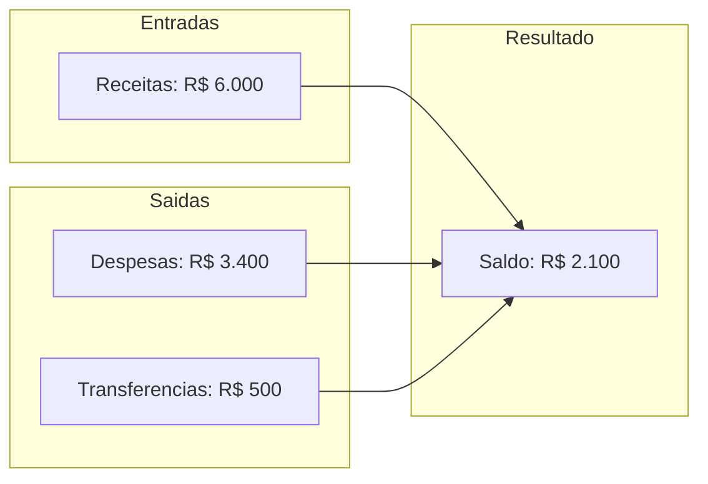
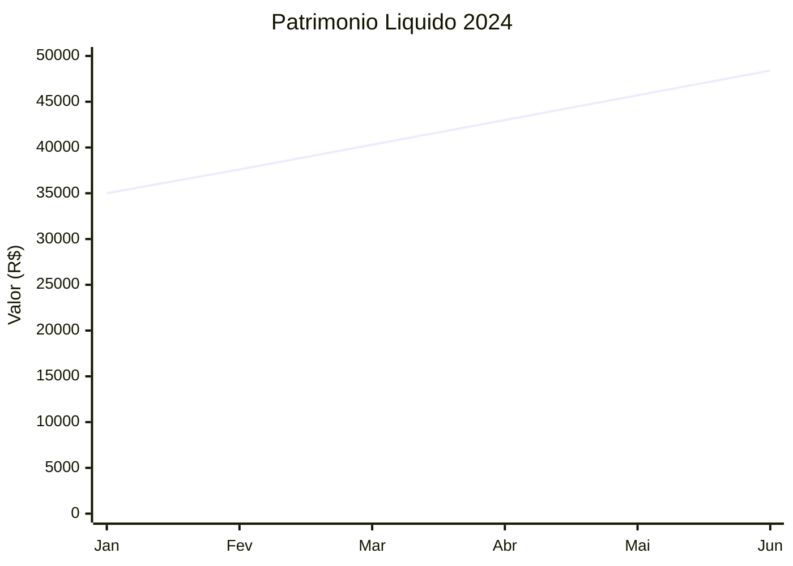

# Relatorios

O FinTrack permite gerar relatorios detalhados para analise financeira.

## Tipos de Relatorio

### Relatorio de Transacoes

Lista detalhada de todas as transacoes em um periodo:

| Campo | Descricao |
|-------|-----------|
| Data | Data da transacao |
| Descricao | Descricao da transacao |
| Categoria | Categoria atribuida |
| Subcategoria | Subcategoria (se houver) |
| Conta/Cartao | Origem da transacao |
| Valor | Valor da transacao |
| Tags | Tags associadas |

### Relatorio por Categoria

Agrupamento de gastos por categoria:

```
CATEGORIA        | TOTAL    | % DO TOTAL | TRANSACOES
-----------------|----------|------------|------------
Alimentacao      | R$ 1.200 | 35%        | 45
Transporte       | R$ 500   | 15%        | 20
Moradia          | R$ 1.000 | 29%        | 5
Lazer            | R$ 400   | 12%        | 15
Outros           | R$ 300   | 9%         | 10
-----------------|----------|------------|------------
TOTAL            | R$ 3.400 | 100%       | 95
```

### Relatorio de Fluxo de Caixa



### Relatorio de Cartao de Credito

Detalhamento por fatura:

```
FATURA JANEIRO 2024
===================
Fechamento: 25/01/2024
Vencimento: 10/02/2024
Status: PAGA

TRANSACOES:
Data     | Descricao          | Categoria    | Valor
---------|--------------------|--------------|---------
05/01    | Amazon Prime       | Assinaturas  | R$ 14,90
08/01    | Supermercado       | Alimentacao  | R$ 350,00
12/01    | Uber               | Transporte   | R$ 45,00
15/01    | Netflix            | Assinaturas  | R$ 39,90
---------|--------------------|--------------|---------
TOTAL                                        | R$ 449,80
```

## Filtros de Relatorio

### Periodo

```typescript
interface PeriodoFiltro {
  tipo: 'hoje' | 'semana' | 'mes' | 'ano' | 'personalizado';
  dataInicio?: Date;
  dataFim?: Date;
}
```

### Conta/Cartao

```typescript
interface ContaFiltro {
  accountIds?: string[];
  cardIds?: string[];
  incluirTodas?: boolean;
}
```

### Categoria

```typescript
interface CategoriaFiltro {
  categoryIds?: string[];
  subcategoryIds?: string[];
  tipo?: 'INCOME' | 'EXPENSE';
}
```

### Tags

```typescript
interface TagFiltro {
  tagIds?: string[];
  operador?: 'AND' | 'OR'; // todas ou qualquer uma
}
```

## API de Relatorios

### Endpoint de Reconciliacao

```bash
# Transacoes pendentes
curl -X GET "http://localhost:8080/api/v1/reconciliation/pending" \
  -H "Authorization: Bearer token" \
  -H "X-Workspace-ID: workspace-id"

# Projecao de recorrentes
curl -X GET "http://localhost:8080/api/v1/reconciliation/projection/{id}" \
  -H "Authorization: Bearer token" \
  -H "X-Workspace-ID: workspace-id"

# Listar todas recorrentes
curl -X GET "http://localhost:8080/api/v1/reconciliation/recurring" \
  -H "Authorization: Bearer token" \
  -H "X-Workspace-ID: workspace-id"
```

## Exportacao

### Formatos Disponiveis

| Formato | Uso |
|---------|-----|
| CSV | Importar em planilhas |
| JSON | Integracao com sistemas |
| PDF | Apresentacao e arquivo |

### Exemplo de Exportacao CSV

```csv
data,descricao,categoria,subcategoria,conta,valor
2024-01-15,Supermercado Extra,Alimentacao,Supermercado,Nubank,-250.00
2024-01-14,Uber,Transporte,Aplicativo,Nubank,-35.00
2024-01-13,Salario,Receita,CLT,Nubank,5000.00
```

## Analises Avancadas

### Comparativo Mensal

```
MES      | RECEITAS | DESPESAS | SALDO   | VAR %
---------|----------|----------|---------|-------
Jan/24   | 6.000    | 3.400    | 2.600   | -
Fev/24   | 6.000    | 3.200    | 2.800   | +7.7%
Mar/24   | 6.500    | 3.800    | 2.700   | -3.6%
```

### Top Despesas

```
RANKING | DESCRICAO              | CATEGORIA    | TOTAL
--------|------------------------|--------------|--------
1       | Aluguel                | Moradia      | R$ 2.000
2       | Supermercado Extra     | Alimentacao  | R$ 850
3       | Cartao de Credito      | Diversos     | R$ 650
4       | Combustivel            | Transporte   | R$ 400
5       | Academia               | Saude        | R$ 150
```

### Evolucao de Patrimonio



## Agendamento de Relatorios

Configure relatorios automaticos:

```typescript
interface RelatorioAgendado {
  tipo: 'transacoes' | 'categoria' | 'fluxo';
  frequencia: 'diario' | 'semanal' | 'mensal';
  destinatarios: string[]; // emails
  filtros: RelatorioFiltros;
  formato: 'csv' | 'pdf';
}
```

## Boas Praticas

### Analise Mensal
- Gere relatorios no inicio de cada mes
- Compare com o mes anterior
- Identifique tendencias

### Controle de Gastos
- Monitore categorias que mais crescem
- Identifique despesas inesperadas
- Acompanhe progresso de metas

### Reconciliacao
- Confira saldos com extratos bancarios
- Identifique transacoes duplicadas
- Corrija categorizacoes incorretas

## Proximos Passos

- [Entenda a arquitetura do sistema](/docs/architecture/overview)
- [Explore a API](/docs/api-reference/authentication)
