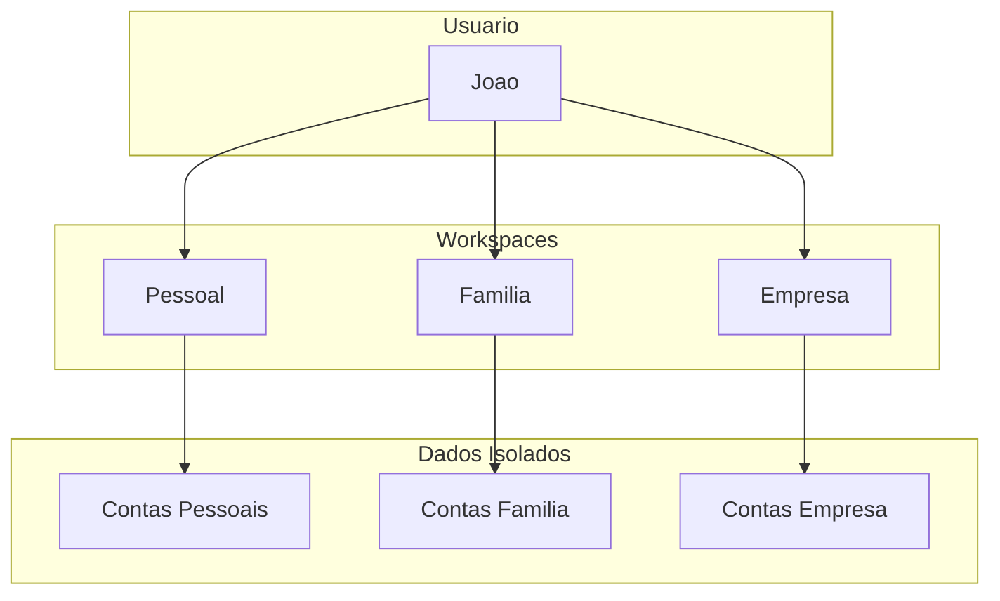
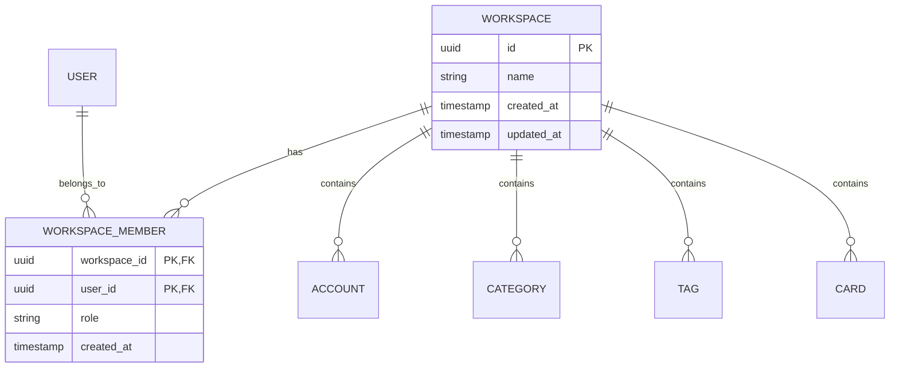

# Workspaces

Workspaces sao contextos isolados de dados financeiros. Cada workspace possui suas proprias contas, categorias, transacoes e membros.

## Conceito



## Casos de Uso

### Financas Pessoais
- Controle individual de gastos
- Acompanhamento de investimentos pessoais
- Metas de economia individuais

### Financas Familiares
- Compartilhamento com conjuge/parceiro(a)
- Controle de despesas da casa
- Planejamento familiar

### Financas Empresariais
- Separacao de PJ e PF
- Controle de receitas do negocio
- Despesas operacionais

## Niveis de Permissao

| Papel | Permissoes |
|-------|------------|
| **Admin** | Acesso total: criar, editar, deletar, convidar membros |
| **Member** | Visualizar e criar transacoes, sem acesso a configuracoes |

## Criar Workspace

### Via Interface

1. Clique no seletor de workspace no menu lateral
2. Selecione "Criar novo workspace"
3. De um nome descritivo
4. Clique em "Criar"

### Via API

```bash
curl -X POST http://localhost:8080/api/v1/workspaces \
  -H "Content-Type: application/json" \
  -H "Authorization: Bearer seu-token-jwt" \
  -d '{
    "name": "Financas Familia Silva"
  }'
```

**Resposta:**

```json
{
  "id": "550e8400-e29b-41d4-a716-446655440000",
  "name": "Financas Familia Silva",
  "created_at": "2024-01-15T10:30:00Z",
  "updated_at": "2024-01-15T10:30:00Z"
}
```

## Alternar entre Workspaces

O FinTrack armazena o workspace ativo no navegador. Para alternar:

1. Clique no nome do workspace atual no menu lateral
2. Selecione o workspace desejado na lista

O header `X-Workspace-ID` e automaticamente enviado em todas as requisicoes.

## Convidar Membros

### Via Interface

1. Acesse Configuracoes > Workspace
2. Clique em "Convidar Membro"
3. Digite o email da pessoa
4. Selecione o papel (Admin ou Member)
5. Clique em "Enviar Convite"

### Via API

```bash
curl -X POST http://localhost:8080/api/v1/workspaces/{id}/invites \
  -H "Content-Type: application/json" \
  -H "Authorization: Bearer seu-token-jwt" \
  -H "X-Workspace-ID: workspace-id" \
  -d '{
    "email": "parceiro@email.com",
    "role": "member"
  }'
```

## Modelo de Dados



## Boas Praticas

### Nomenclatura
- Use nomes descritivos e unicos
- Inclua o contexto (ex: "Casa - Joao e Maria")
- Evite abreviacoes confusas

### Organizacao
- Mantenha financas pessoais separadas de empresariais
- Crie workspaces especificos para projetos temporarios
- Archive workspaces inativos

### Seguranca
- Convide apenas pessoas de confianca
- Use o papel "Member" para acesso limitado
- Revise periodicamente os membros

## Listar Workspaces

```bash
curl -X GET http://localhost:8080/api/v1/workspaces \
  -H "Authorization: Bearer seu-token-jwt"
```

**Resposta:**

```json
[
  {
    "id": "550e8400-e29b-41d4-a716-446655440000",
    "name": "Financas Pessoais",
    "role": "ADMIN",
    "created_at": "2024-01-15T10:30:00Z"
  },
  {
    "id": "550e8400-e29b-41d4-a716-446655440001",
    "name": "Financas Familia",
    "role": "MEMBER",
    "created_at": "2024-01-20T14:00:00Z"
  }
]
```

## Proximos Passos

- [Cadastrar contas e cartoes](/docs/user-guide/accounts-and-cards)
- [Importar transacoes](/docs/user-guide/importing-transactions)
